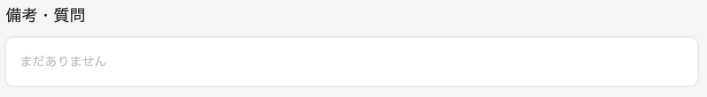
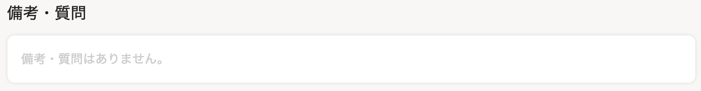
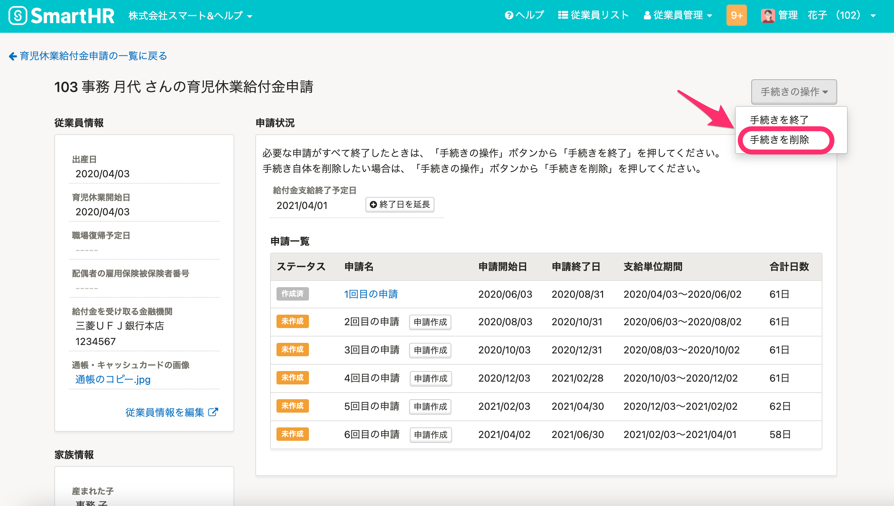

2021年4月19日（月）に行なったアップデートの詳細をお知らせします。

SmartHR基本機能の変更点は、カイゼン2件・不具合修正1件でした。

# 📈 カイゼン

## 申請の［備考・質問］が未入力の場合の文言を変更しました

申請フォームの **［備考・質問］** が未入力の場合に、入力確認画面と申請詳細画面で表示される **［備考・質問］** 欄の文言を **［まだありません］** から **［備考・質問はありません。］** に変更しました。

| 変更前 |  |
| --- | --- |
| 変更後 |  |

## 電子申請送信済の「育児休業給付金申請」を削除できるようにしました

これまでは「育児休業給付金申請」を電子申請したあとに申請内容に変更がある場合でも、ユーザー自身で手続きを削除できませんでした。

そのため今回の改修で、電子申請送信後も修正などがあった場合は手続きを削除できるようにしました。

削除した手続きの電子申請は、電子申請一覧画面から閲覧できます。

# 👨‍⚕️ 不具合修正

申請フォームの「複製」機能に関する1件の不具合修正を行ないました。
