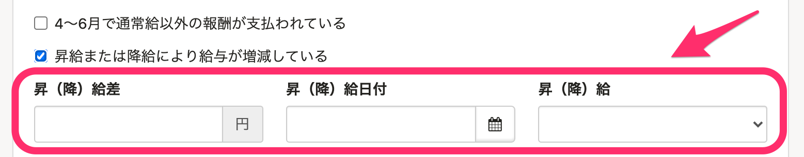
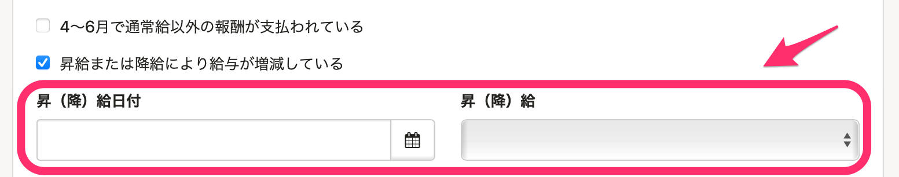
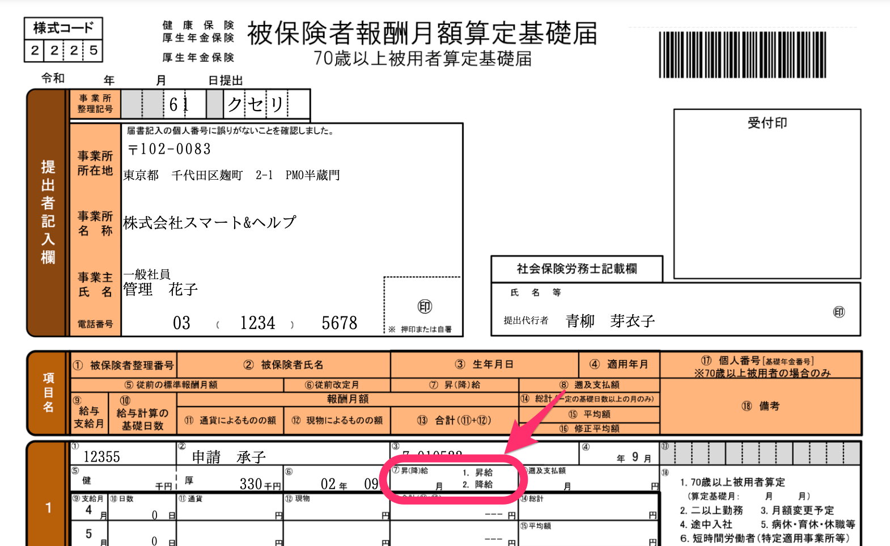
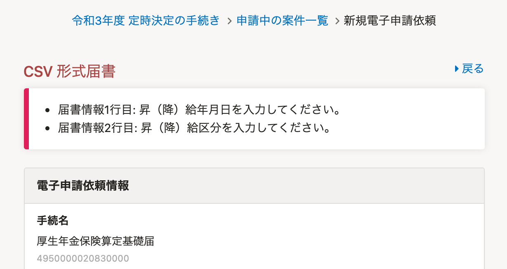

2021年4月20日（火）に行なったアップデートの詳細をお知らせします。

SmartHR基本機能の変更点は、カイゼン1件・不具合修正1件でした。

# 📈 カイゼン

## 定時決定手続きから［昇（降）給差］の項目を削除しました

定時決定手続きの書類編集画面から、 **［昇給または降給により給与が増減している］** にチェックを入れると表示される **［昇（降）給差］** の項目を削除しました。

| 変更前 |  |
| --- | --- |
| 変更後 |  |

そのため電子申請の **［⑦ 昇（降）給］** 区分は、書類編集画面での **［昇（降）給］** の値を反映させるようにしました。

また電子申請をする際は、 **［昇（降）給日付］** か **［昇（降）給］** のどちらかの項目が空欄の場合に、下図のエラーメッセージを表示させるようにしました。

両方入力されている、もしくは両方空欄の場合は表示されません。

# 👨‍⚕️ 不具合修正

電子申請詳細画面のパネル表示に関する1件の不具合修正を行ないました。
