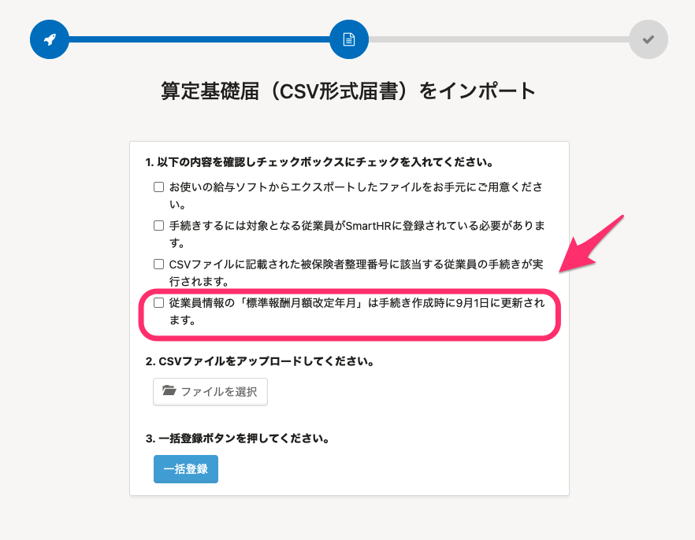
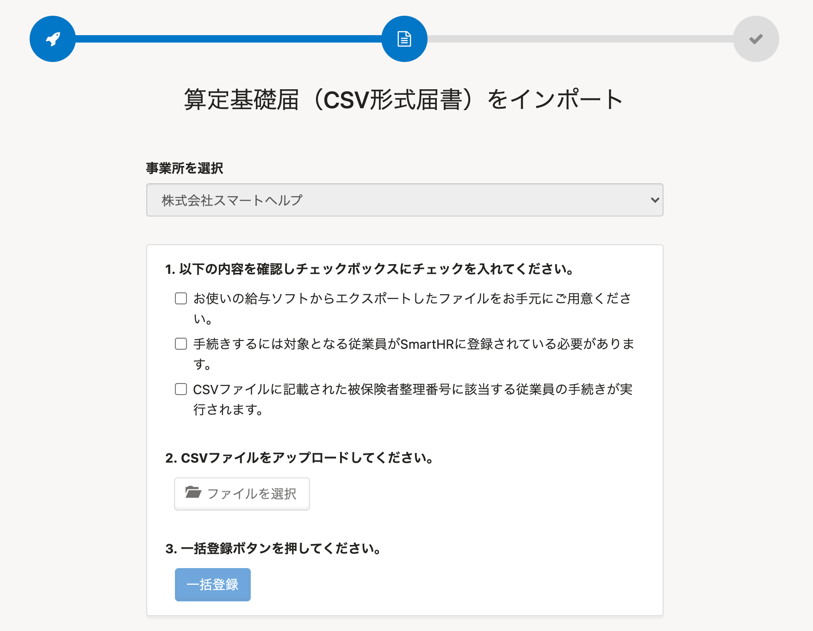

2021年4月21日（水）に行なったアップデートの詳細をお知らせします。

SmartHR基本機能の変更点は、カイゼン1件・不具合修正1件でした。

# 📈 カイゼン

##  **［標準報酬月額改定年月］** を「定時決定手続き」作成時の9月1日に更新しないようにしました

これまではCSV形式で「定時決定手続き」を作成した場合、従業員情報の **［標準報酬月額改定年月］** は、手続きを作成する9月1日に更新する仕様でした。

しかし令和3年度からは、CSVファイルの突合項目を変更したため、その仕様を廃止しました。

そのため、［算定基礎届（CSV形式届書）をインポート］の画面から、 **［従業員情報の「標準報酬月額改定年月」は、手続き作成時に9月1日に更新されます。］** という確認のチェック項目を削除しました。

| 変更前 |  |
| --- | --- |
| 変更後 |  |

# 👨‍⚕️ 不具合修正

削除した電子申請詳細画面の挙動に関する1件の不具合修正を行ないました。
