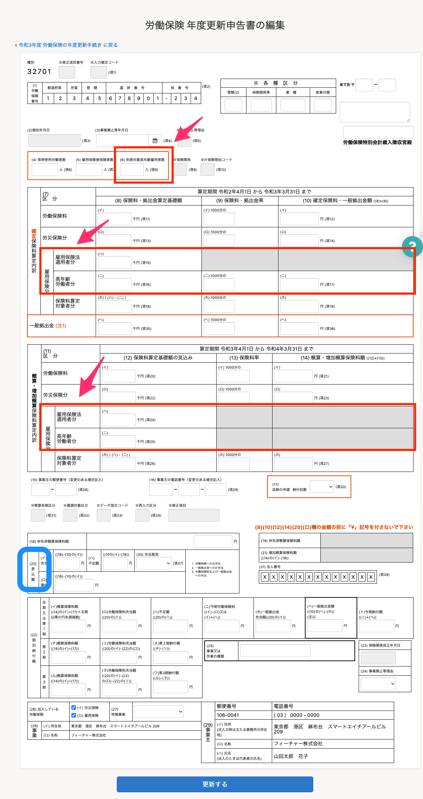
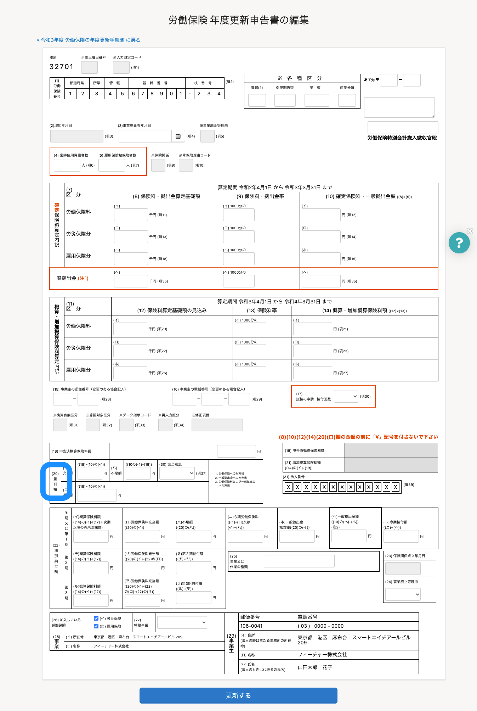
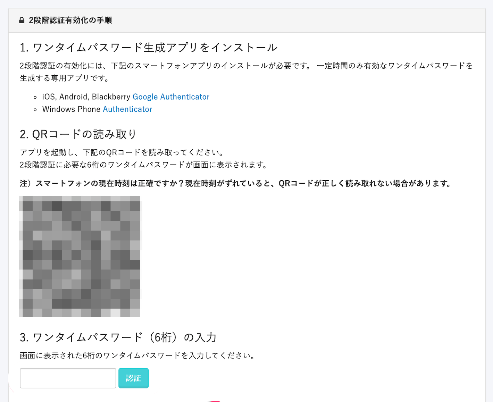
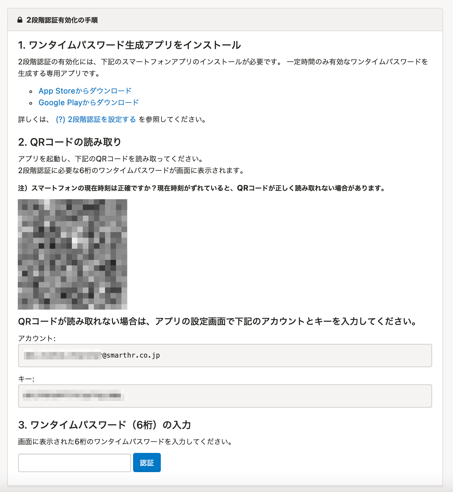
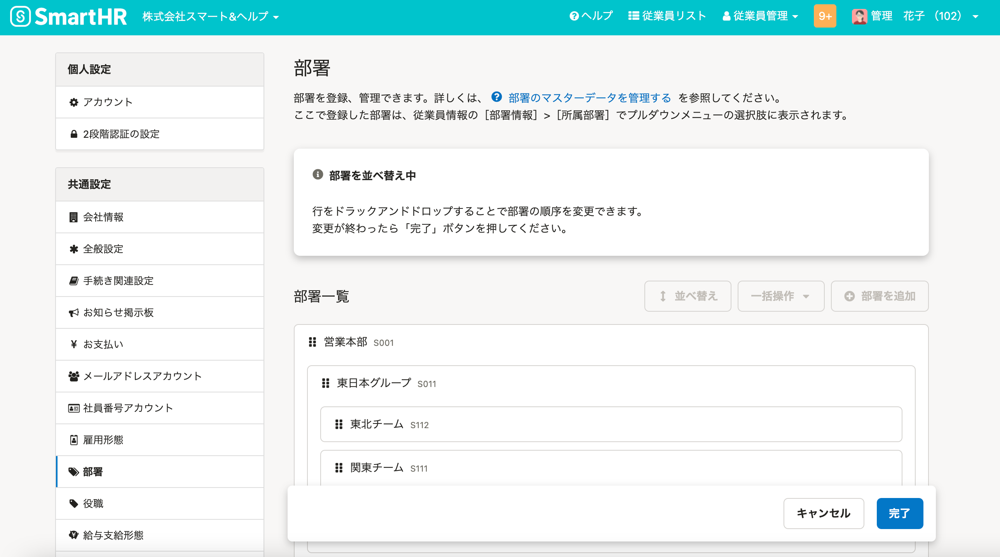

2021年4月26日（月）に行なったアップデートの詳細をお知らせします。

SmartHR基本機能の変更点は、カイゼン4件でした。

# 📈 カイゼン

## 令和3年版「労働保険 年度更新申告書」に対応しました

「労働保険 年度更新申告書」の作成画面を下記のとおり変更し、令和3年版に対応しました。

- （6）・（7）一部・（11）一部の項目を削除（下図赤枠）
- （20）の項目名を **［差込額］** から **［差引額］** に変更（下図青枠）

:::related
[SmartHRで年度更新手続きをする](https://knowledge.smarthr.jp/hc/ja/articles/360026107074)
:::

| 変更前 |  |
| --- | --- |
| 変更後 |  |

## 2段階認証をスマートフォンのみで設定できるようにしました

これまでは2段階認証を設定する際、端末がスマートフォン1台しか使えないなど、QRコードを読み取れない場合の対応方法がありませんでした。

そこで今回の改修で、QRコードが読み取れない場合のために、 **［アカウント］** と **［キー］** を発行しスマートフォンのアプリに入力することで設定を完了できるようにしました。

:::related
[2段階認証を設定する](https://knowledge.smarthr.jp/hc/ja/articles/360026106174)
:::

| 変更前 |  |
| --- | --- |
| 変更後 |  |

## 「退職済」従業員でも退職手続きを作成できるようにしました

これまでは「退職済」ステータスの従業員の退職手続きは作成できませんでした。

しかし、退職後にも退職手続きを作成するケースがあるため、「退職済」でも退職手続きを作成できるように変更しました。

## ［部署一覧］の部署を並べ替えられるようにしました

 **［部署一覧］** の部署を並べ替えできるようにしました。

