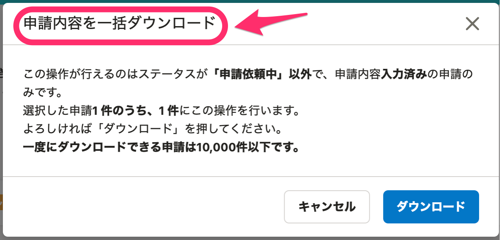

2021年4月27日（火）に行なったアップデートの詳細をお知らせします。

SmartHR基本機能の変更点は、カイゼン8件でした。

# 📈 カイゼン

## 2020年版「健康保険被扶養者（異動）・国民年金第３号被保険者関係届」の電子申請に対応しました

先日のリリースで、「健康保険被扶養者（異動）・国民年金第３号被保険者関係届」の手続き書類を新様式に対応させましたが、今回のリリースで電子申請にも対応させました。

:::related
[2021/03/02 従業員情報・申請／招待／育休情報フォーム配下の \[通帳の画像\] ラベルの文言を変更しました 他4件](https://knowledge.smarthr.jp/hc/ja/articles/900005694183)
:::

「その他の被扶養者」は1度に2名まで申請可能となりました。

また、これまでは旧様式の書類は電子申請に対応していないことをダイアログ上で注意喚起していましたが、対処法が不明だったため、お知らせリンク（[健康保険被扶養者（異動）・国民年金第３号被保険者関係届の様式変更に伴うお知らせ](https://smarthr.jp/other/24161)）も設置するようにし、具体的な対処法を確認できるようにしました。

| 変更前 |  |
| --- | --- |
| 変更後 |  |

## 経路詳細画面の編集ボタンに操作名を明記しました

共通設定 > 申請 > 経路の詳細画面にある経路を編集するボタンを、3点リーダーから **「経路を操作」** に変更しました。

操作名を明記するという、SmartHR全体のデザインルールに合わせたものです。

| 変更前 |  |
| --- | --- |
| 変更後 |  |

## 「高年齢雇用継続給付受給資格確認票・（初回）高年齢雇用継続給付支給申請書」のe-Gov新様式に対応しました

「高年齢雇用継続基本給付金申請（初回）」の手続きの際に作成される **「高年齢雇用継続給付受給資格確認票・（初回）高年齢雇用継続給付支給申請書」・「雇用保険被保険者六十歳到達時等賃金証明書」** のe-Govの仕様に、様式IDの変更や項目の追加があったため、対応しました。

:::related
[高年齢雇用継続給付金申請の電子申請を作成する](https://knowledge.smarthr.jp/hc/ja/articles/360045344294)
:::

## 高年齢雇用継続基本給付金の申請（2回目以降）のe-Gov新様式に対応しました

高年齢雇用継続基本給付金の申請（2回目以降）で作成される **「高年齢雇用継続給付支給申請書」** のe-Govの仕様に、様式IDの変更や項目の追加があったため、対応しました。

## 雇用保険育児休業給付（育児休業給付金）の申請（初回申請）（令和３年３月以降手続き）の仕様変更に対応しました

育児休業給付金申請の手続きで作成される **「育児休業給付受給資格確認票・（初回）育児休業給付金申請書」** のe-Govの仕様に、様式IDの変更と項目の追加があったため、対応しました。

:::related
[育児休業給付金申請の電子申請を作成する](https://knowledge.smarthr.jp/hc/ja/articles/360045900393)
:::

## ［行政手続きToDo一覧］の表示速度をカイゼンしました

 **［行政手続きToDo一覧］の** 進捗ステータスバーの表示が遅いことがあったため、パフォーマンスを最適化し、表示速度をカイゼンしました。

## 申請一覧の一括操作ボタンの文言を明確にしました

申請一覧で選択した従業員を一括操作する部分にある操作ボタンの意味を明確にするため、文言を下図のとおり見直しました。

| 変更前 |  |
| --- | --- |
| 変更後 |  |

また、 **［申請内容を一括ダウンロード］** をクリックした際に表示されるダイアログのタイトルも、操作ボタンに合わせました。

| 変更前 |  |
| --- | --- |
| 変更後 |  |

 **［申請内容を一括ダウンロード］** をクリックしたあとに表示されるパネルのタイトルも下図のとおり変更しました。

| 変更前 |  |
| --- | --- |
| 変更後 |  |

## 部署一覧に部署数が500件以上表示されている場合、注意喚起のダイアログを表示させました

部署一覧に部署数が大量に表示された状態で **「並べ替え」** をクリックすると、表示するまでに時間がかかることがありました。

そのため部署数が500件以上表示されている場合は、 **「並べ替え」** ボタンをクリックしたあとに下図の注意喚起のダイアログを表示させ、部署数を絞ってから表示することを推奨するようにしました。

