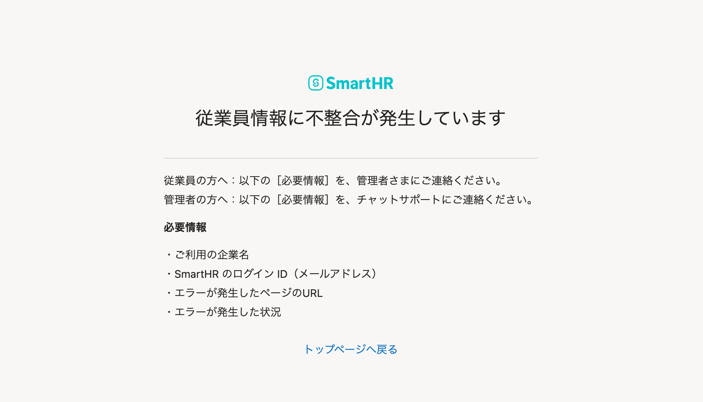

2021年5月10日（月）に行なったアップデートの詳細をお知らせします。

SmartHR基本機能の変更点は、カイゼン5件でした。

# 📈 カイゼン

## 高年齢再就職給付金の申請（2回目以降）のe-Gov新様式に対応しました

高年齢再就職給付金の申請（2回目以降）で作成される **「高年齢雇用継続給付支給申請書」** のe-Govの仕様に様式IDの変更や項目の追加があったため、対応しました。

## 申請を提出した際に「不整合」が原因でエラーが発生した場合に、原因を特定しやすくしました

申請内容を入力し **［確認］** をクリックした後に「不整合」が原因でエラーが発生する場合があります。

その際に専用のエラー画面を表示させ、お問い合わせをいただく際に原因を特定しやすくしました。

## 部署を一括登録・一括更新した際の挙動をカイゼンしました

部署を一括登録・一括更新した際、部署コードが空の行が含まれていた場合に表示されるエラーメッセージがわかりにくいものだったので、挙動をカイゼンしました。

## 部署数が500件を超える場合、1階層目のみを表示するようにしました

部署が大量に登録されている場合、一覧表示に時間がかかることがあったため、部署数が500件を超える場合は1階層目のみを表示するようにしました。

## CSV形式で「定時決定手続き」を作成した場合、「整理番号」「マイナンバー」「基礎年金番号」でも突合するようにしました

これまではCSV形式で「定時決定手続き」を作成した場合、CSVファイルの整理番号とSmartHRの従業員情報の整理番号で突合していましたが、今回のリリースから整理番号のない従業員にも対応するために、「整理番号」「マイナンバー」「基礎年金番号」でも突合するようにしました。

:::related
[定時決定の手続きを電子申請する](https://knowledge.smarthr.jp/hc/ja/articles/360049895434)
:::
