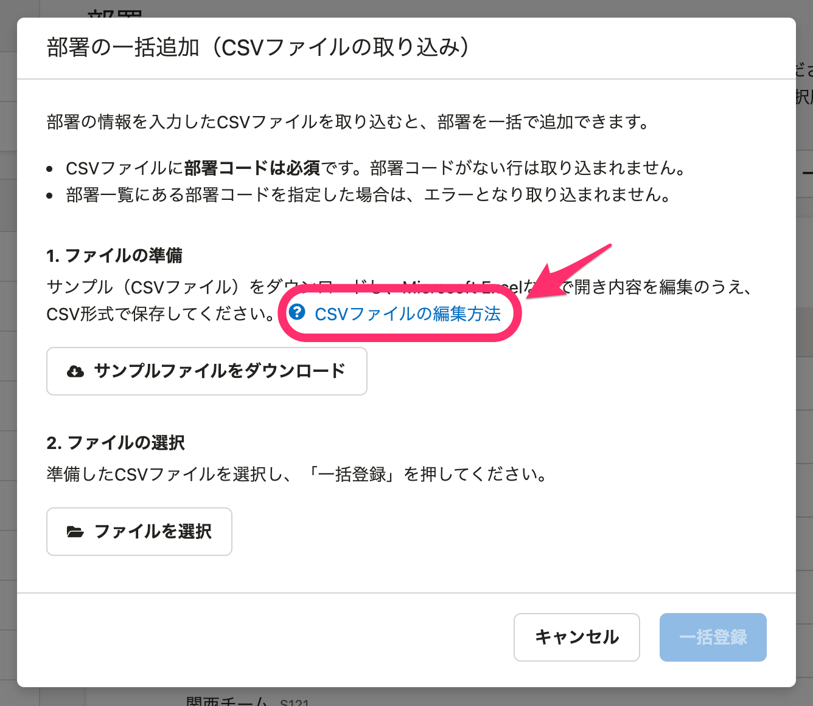

2021年5月11日（火）に行なったアップデートの詳細をお知らせします。

SmartHR基本機能の変更点は、カイゼン2件でした。

# 📈 カイゼン

## 部署を［↑］［↓］ボタンで並び替えられるようにしました

 **［部署一覧］** に **［↑］［↓］** ボタンを設置し、クリックして部署を並べ替えられるようにしました。

これまでどおりドラッグアンドドロップでも動かせます。

| 変更前 | 変更後 |
| --- | --- |
|  |  |

:::related
[部署のマスターデータを管理する](https://knowledge.smarthr.jp/hc/ja/articles/360036111074)
:::

## ［部署を一括追加（CSV）］と［部署を一括更新（CSV）］のダイアログにヘルプページへのリンクを追加しました

部署の［一括操作］> **［部署を一括追加（CSV）］** と **［部署を一括更新（CSV）］** のダイアログに、以下のヘルプページ へのリンクを追加しました。

[Q. 部署マスターの一括追加・一括更新の際のCSVファイルの書き方は？](https://knowledge.smarthr.jp/hc/ja/articles/900005246306)

CSVファイルの構成や、部署名・部署コードを入力する際の手順が説明されています。

| 変更前 | 変更後 |
| --- | --- |
|  |  |
