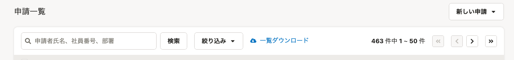
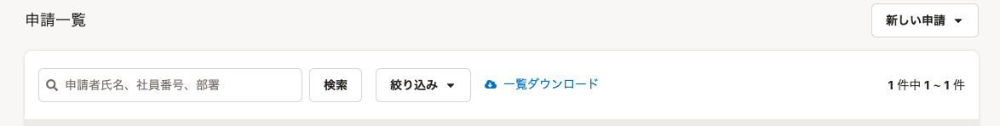
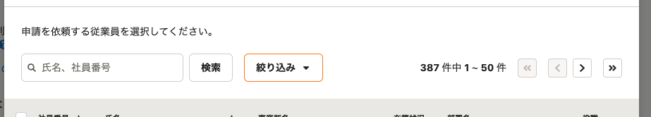

2021年5月13日（木）に行なったアップデートの詳細をお知らせします。

SmartHR基本機能の変更点は、カイゼン2件でした。

# 📈 カイゼン

## 「雇用保険被保険者転勤届」の電子申請の新様式に対応しました

事業所変更の手続きで作成される「雇用保険被保険者転勤届」のe-Govの仕様に様式IDの変更や項目の追加があったため、新様式に対応しました。

## 申請に関する画面のボタンなどの間隔を調整しました

SmartHR全体のデザインルールに合わせて、申請に関する画面のボタンなどの間隔を調整しました。

-  **［申請一覧］** 

| 変更前 |  |
| --- | --- |
| 変更後 |  |

-  **［新しく申請を依頼する］** のダイアログ

| 変更前 |  |
| --- | --- |
| 変更後 |  |
