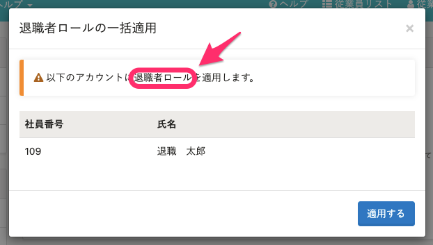

2021年5月19日（水）に行なったアップデートの詳細をお知らせします。

SmartHR基本機能の変更点は、カイゼン4件・アクセシビリティ1件でした。

# 📈 カイゼン

## 定時決定手続きで、70歳以上被用者に該当する従業員は「従前の標準報酬月額（厚生年金）」の項目が空になるようにしました

定時決定の手続きで作成される「健康保険・厚生年金保険 被保険者報酬月額算定基礎届」で、70歳以上被用者に該当する従業員は「従前の標準報酬月額（厚生年金）」の項目が空になるようにしました。

こちらは、70歳に到達する誕生日の前日に厚生年金の資格を喪失するため、書類と電子申請では空にするようにしていますが、従業員情報は変更されません。

## メールアドレスアカウント一覧、社員番号アカウント一覧画面の権限関連の文言を表記ルールに揃えました

SmartHR全体の表記ルールに合わせて、メールアドレスアカウントや社員番号アカウント画面などにあった **［ロール］** を **［権限］** に変更しました。

- メールアドレスアカウント画面の一例

| 変更前 | 変更後 |
| --- | --- |
|  |  |
|  |  |

- 社員番号アカウント画面の一例

| 変更前 | 変更後 |
| --- | --- |
|  |  |
|  |  |

## 部署を並べ替えた際の内部動作をカイゼンしました

部署の並べ替えをした際の内部動作を見直し、大量の部署が登録されている場合でも表示速度が遅くならないようにしました。

## 部署の登録上限を設けました

部署を15,000件まで登録できるようにしました。

# 🎢 アクセシビリティ

## 定時決定手続きの電子申請依頼作成での入力値チェックの動作を変更しました

定時決定手続きの電子申請可能になる目処を6月から7月に変更し、電子申請依頼作成の際に、「整理番号」「マイナンバー」「基礎年金番号」のいずれかが登録されていなければエラーになるように入力値チェックの動作を変更しました。

:::related
[【令和3年度の電子申請】年度更新は6月1日（火）、定時決定は7月1日（木）に提供予定です](https://smarthr.jp/update/24869)
:::

