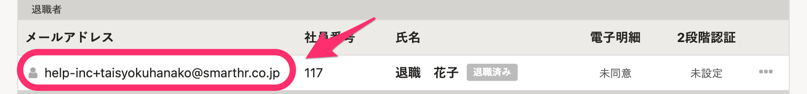
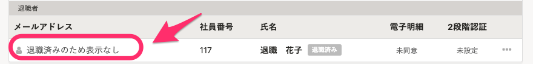

2021年5月20日（木）に行なったアップデートの詳細をお知らせします。

SmartHR基本機能の変更点は、カイゼン1件でした。

# 📈 カイゼン

## 退職済みの従業員に紐づくアカウントのメールアドレスを表示しないようにしました

これまでは、メールアドレスアカウント一覧などに退職済み従業員に紐づくアカウントのメールアドレスが表示されていましたが、個人情報保護の観点から、 **［退職済みのため表示なし］** と表示するよう変更しました。

該当画面は下記のとおりです。

- メールアドレスアカウント一覧
- メールアドレスアカウントの編集画面
- 社員番号アカウント一覧（メールアドレスが設定されている場合）
- SAML SSOアカウント一覧
- SAML SSOアカウントの編集画面
- マルチログインアカウントの招待の管理画面

例：メールアドレスアカウント一覧

| 変更前 |  |
| --- | --- |
| 変更後 |  |

また、合わせて以下の対応もしています。

- 退職済みの従業員に紐づいているアカウントがメールアドレスを変更した際の、管理者向けの変更通知の廃止
- メールアドレスアカウント権限の一括更新の対象から、退職済み従業員を除外
    - アカウント更新用テンプレートファイルに、退職済みの従業員情報を含まないようにしました。
    - もし、CSVファイルに退職済み従業員の情報を含んで更新しようとした場合は、エラーになります。
