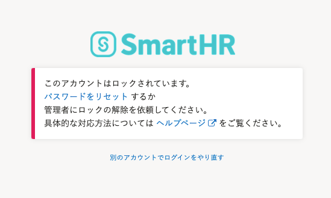
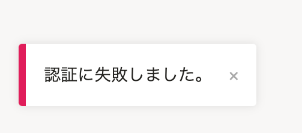
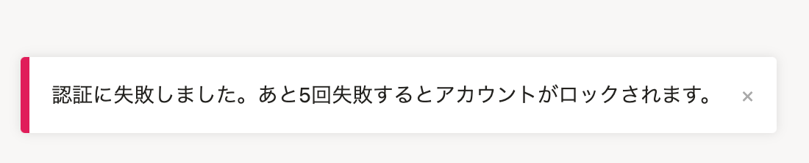

2021年5月24日（月）に行なったアップデートの詳細をお知らせします。

SmartHR基本機能の変更点は、新機能1件でした。

# ✨ 新機能

## ログインに繰り返し失敗した場合にアカウントをロックするようにしました

不正なログインを防ぐため、SmartHRにログインする際にパスワードを10回間違えると、アカウントをロックするようにしました。

アカウントがロックされると、ログイン操作ができなくなります。

アカウントロックは、パスワードリセットか、管理者がロック解除の操作をすることで解除できます。

:::related
[アカウントロックを解除する](https://knowledge.smarthr.jp/hc/ja/articles/900005926686)
[Q. 「このアカウントはロックされています。」と表示される場合は？](https://knowledge.smarthr.jp/hc/ja/articles/900006890363)
:::

- パスワードの試行に10回失敗した画面

- 5回失敗するまでは、今まで通りのフラッシュメッセージが出ます。

- 5回失敗するとカウントダウンが始まります。

