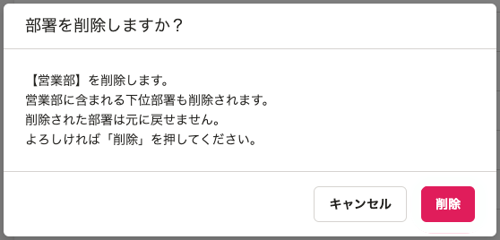
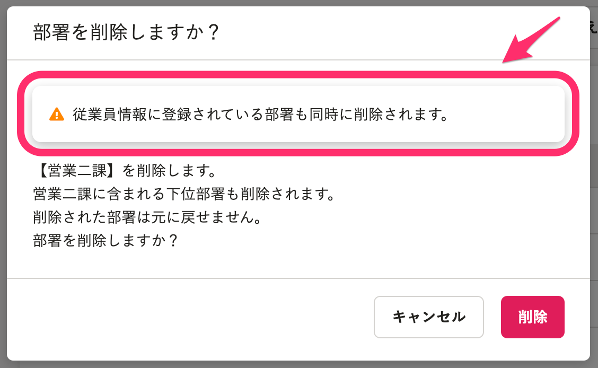

2021年5月25日（火）に行なったアップデートの詳細をお知らせします。

SmartHR基本機能の変更点は、カイゼン1件・不具合修正1件でした。

# 📈 カイゼン

## 部署マスターから部署を削除する際に、従業員情報の部署情報も削除される旨を表示するようにしました

部署マスターから部署を削除する際に表示されるダイアログに、 **［**  **従業員情報に登録されている部署も同時に削除されます。］** というメッセージを表示するようにしました。

これまでは、業員情報に紐づいていた部署情報も削除されることがわからなかったため、パネルとして表示することで、事前に把握していただきたい、という狙いがあります。

また、ダイアログ内のその他のメッセージも、SmartHR全体の表記に合わせて変更しました。

| 変更前 | 変更後 |
| --- | --- |
|  |  |

# 👨‍⚕️ 不具合修正

社員番号アカウントの設定用CSVファイルに関する1件の不具合修正を行ないました。
