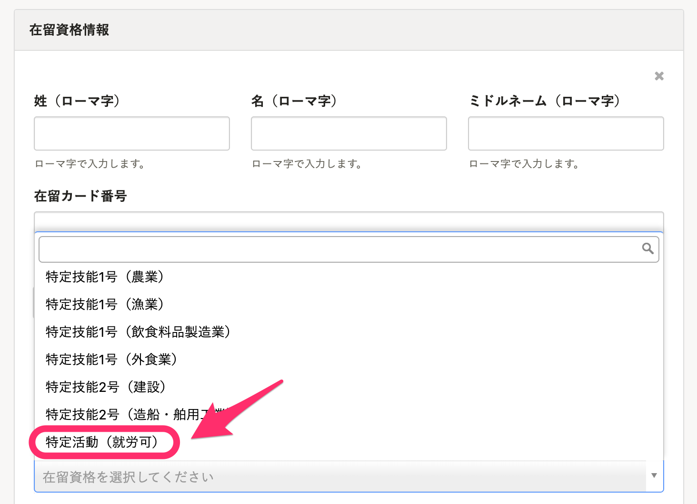

2021年5月26日（水）に行なったアップデートの詳細をお知らせします。

SmartHR基本機能の変更点は、カイゼン1件でした。

# 📈 カイゼン

## 令和3年3月以降手続きの「雇用保険被保険者資格取得届」と「雇用保険被保険者資格喪失届」のe-Gov新様式に対応しました

令和3年3月以降手続きの「雇用保険被保険者資格取得届」と「雇用保険被保険者資格喪失届」のe-Govの仕様に様式IDの変更や項目の追加があったため、新様式に対応しました。

また、新たに在留資格の項目が追加されたため、従業員情報の **［在留資格情報］>［在留資格］** に **［**  **特定活動（就労可）］** の項目を追加し、新様式の書類にも対応しました。

