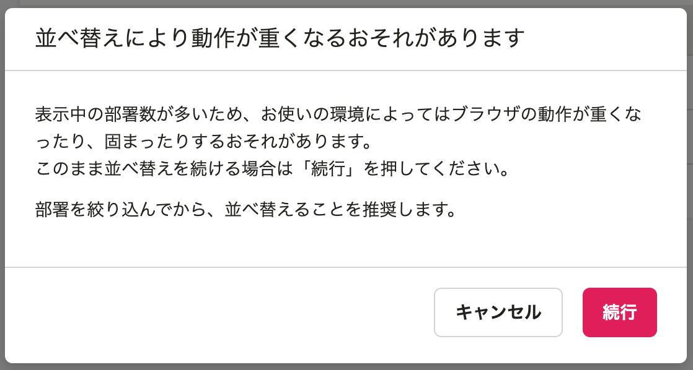
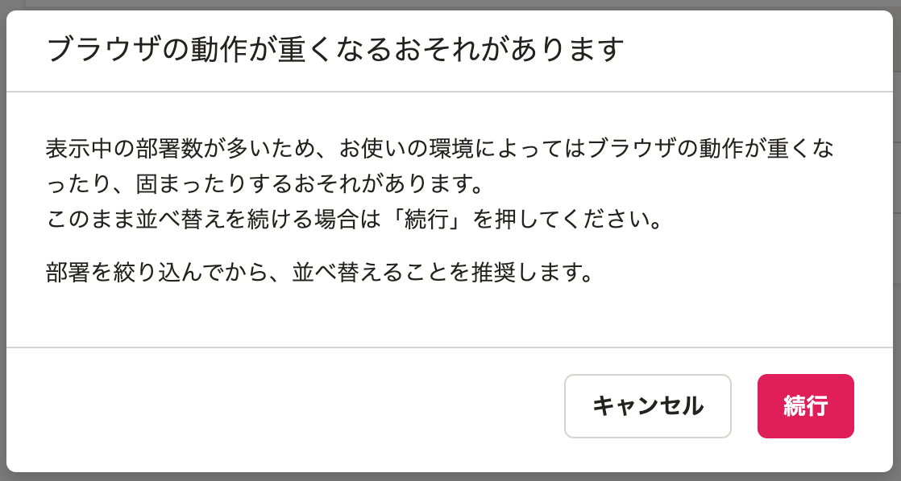

2021年5月28日（金）に行なったアップデートの詳細をお知らせします。

SmartHR基本機能の変更点は、カイゼン2件・不具合修正1件でした。

# 📈 カイゼン

## 部署を並べ替える際のダイアログのタイトルを変更しました

部署が500件以上ある状態で並べ替えをする際に表示されるダイアログのタイトルを **［並べ替えにより動作が重くなるおそれがあります］** から、 **［ブラウザの動作が重くなるおそれがあります］** に変更しました。

並べ替えが原因で重くなるわけではないため、より適切な表現へ変更する目的です。

| 変更前 | 変更後 |
| --- | --- |
|  |  |

## ログイン画面のSmartHRのロゴマークをクリックしても、ページを移動しないようにしました

ログイン画面上部にあるSmartHRのロゴマークをクリックすると、https://app.smarthr.jp/login（汎用のログインURL）へ移動するようリンクを設定していましたが、専用のログイン画面を操作中に誤ってクリックしてログインに失敗してしまうケースがあったため、リンクの設定を解除しました。

# 👨‍⚕️ 不具合修正

雇用保険被保険者離職証明書の被保険者期間算定対象期間の説明文に関する1件の不具合修正を行ないました。
