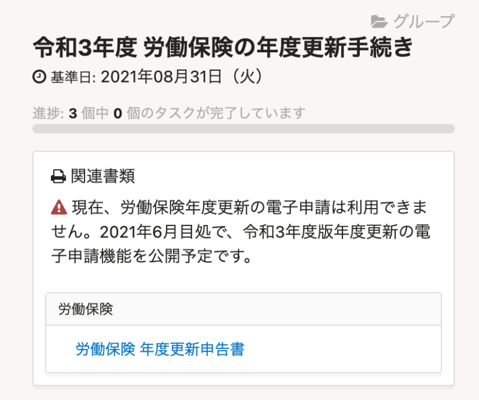
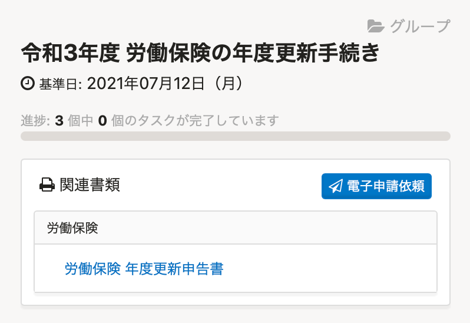
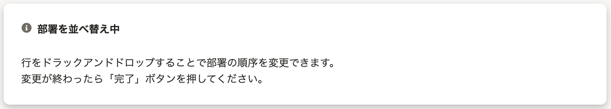
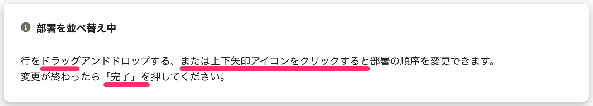
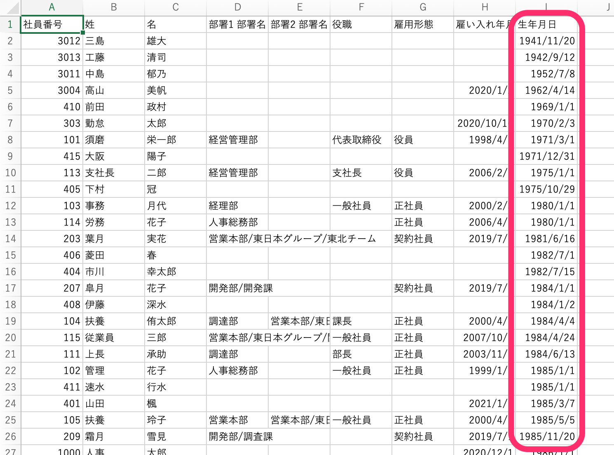

2021年5月31日（月）に行なったアップデートの詳細をお知らせします。

SmartHR基本機能の変更点は、新機能1件・カイゼン2件・不具合修正1件でした。

# ✨ 新機能

## 令和3年度「労働保険の年度更新」の電子申請機能を公開しました

:::related
[【令和3年度の電子申請】年度更新は6月1日（火）、定時決定は7月1日（木）に提供予定です](https://smarthr.jp/update/24869)
:::

6月1日より令和3年度の「労働保険の年度更新」の電子申請ができるようになったため、 **［電子申請依頼］** ボタンを表示させ、電子申請依頼の実行に進めるようにしました。

| 変更前 | 変更後 |
| --- | --- |
|  |  |

# 📈 カイゼン

## 部署の並べ替えヒントの文言を変更しました

部署を並べ替える際に表示されるヒントの文言を下記のとおり変更しました。

- ドラックアンドドロップ→ドラッグアンドドロップ
- 上下矢印ボタンについての説明を追加
- 「完了」ボタン→「完了」

| 変更前 | 変更後 |
| --- | --- |
|  |  |

## 従業員情報をダウンロードした際にソート条件を反映できるようにしました

これまでは従業員リストから従業員情報をダウンロードした際、社員番号の昇順で出力表示されていましたが、従業員リストで設定したソート順を出力に反映できるようにしました。

なおダウンロードする際に、 **［ダウンロード対象の従業員］** を **［**  **全従業員 （在職・休職・退職すべて）］** に選択している場合は、これまでどおり社員番号の昇順で出力されます。

例：［ソート］を［生年月日］の昇順にした場合

# 👨‍⚕️ 不具合修正

特定条件下での扶養追加手続きを **［すべて完了する］** にした際の挙動に関する1件の不具合修正を行ないました。
