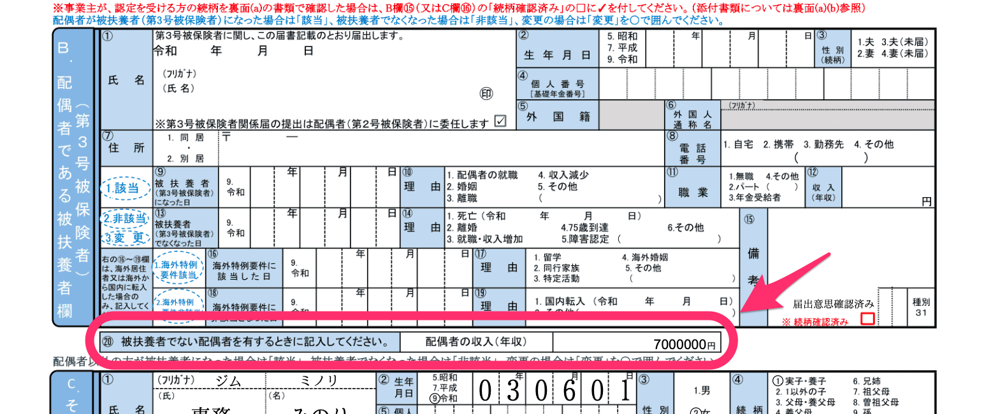

2021年6月3日（木）に行なったアップデートの詳細をお知らせします。

SmartHR基本機能の変更点は、不具合修正3件でした。

# 👨‍⚕️ 不具合修正

## 被扶養者ではない配偶者がいる場合に「健康保険被扶養者（異動）届・国民年金第3号被保険者関係届」の配偶者の収入欄に印字するようにしました

これまでは、協会けんぽ・東京都情報サービス産業健保・その他の健保で「健康保険被扶養者（異動）届・国民年金第3号被保険者関係届」を作成した際、「配偶者の収入」欄に、被扶養者ではない配偶者の年収が記載されませんでした。

今回の修正で、入社手続きなどで「健康保険被扶養者（異動）届・国民年金第3号被保険者関係届」の書類を生成した際、配偶者の年収を印字するようにしました。

2021年6月4日午後12時以降に作成された申請に適用されます。

**健康保険被扶養者（異動）届・国民年金第3号被保険者関係届**

そのほか、Internet Explorerでファイルをダウンロードした際の挙動に関する修正など、2件の不具合修正を行ないました。
