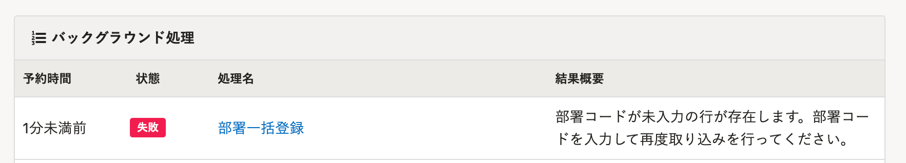

2021年6月7日（月）に行なったアップデートの詳細をお知らせします。

SmartHR基本機能の変更点は、カイゼン1件・不具合修正1件でした。

# 📈 カイゼン

## 部署の一括追加・更新の際、部署コードが未入力であることを伝えるエラーメッセージを変更しました

これまでは、部署の一括追加・更新のためにCSVファイルを取り込む際に、未入力の部署コードが複数ある場合、 **［次の部署コードが重複しています： ］** というエラーメッセージを表示していました。

しかし、エラーの内容がわかりにくかったため、内容を明確にするため **［部署コードが未入力の行が存在します。部署コードを入力して再度取り込みを行ってください。］** に変更しました。

# 👨‍⚕️ 不具合修正

大量の従業員を作成・更新などを行なったことがあるアカウントを削除した際、SmartHRへのアクセスがしづらい状況になることに関する1件の不具合修正を行ないました。
