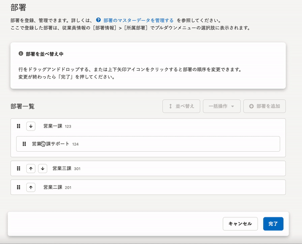

2021年6月8日（火）に行なったアップデートの詳細をお知らせします。

SmartHR基本機能の変更点は、カイゼン1件・不具合修正1件でした。

# 📈 カイゼン

## 部署を並べ替えた際の動きをわかりやすくしました

部署マスターの管理画面で部署を **［↑］［↓］** をクリックして並べ替えた際に、動かした部署の背景色を青くして部署の動きを追えるようにしました。

# 👨‍⚕️ 不具合修正

登録済みの画像やファイルのプレビュー表示に関する1件の不具合修正を行ないました。
