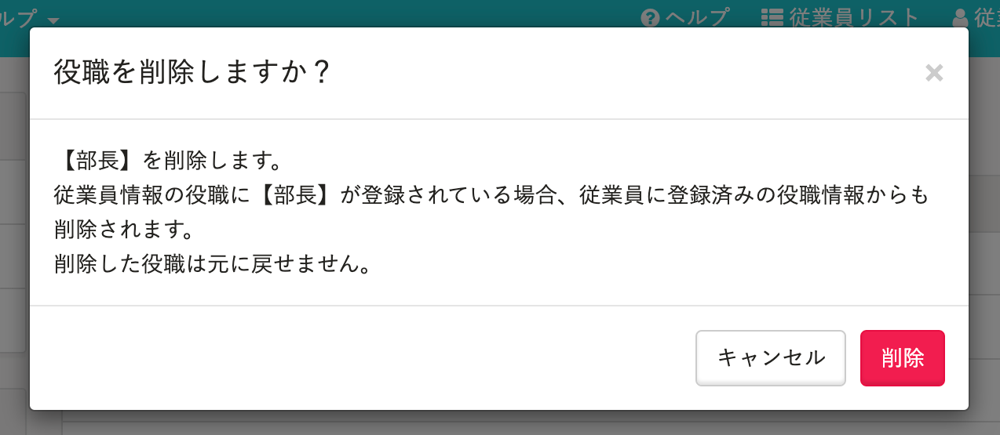

2021年6月9日（水）に行なったアップデートの詳細をお知らせします。

SmartHR基本機能の変更点は、カイゼン2件でした。

# 📈 カイゼン

## 「健康保険被扶養者（異動）届・国民年金第3号被保険者関係届」の被扶養者ではない配偶者の年収をカンマ区切りで表示するようにしました

「健康保険被扶養者（異動）届・国民年金第3号被保険者関係届」の被扶養者でない配偶者の年収を、他の項目に合わせてカンマ区切りで表示するようにしました。

## 役職マスターの削除モーダルを適切に変更する

SmartHR全体の表記ルールに合わせて、役職マスターの削除ダイアログの文言を下図のとおり変更しました。

| 変更前 | 変更後 |
| --- | --- |
|  |  |
