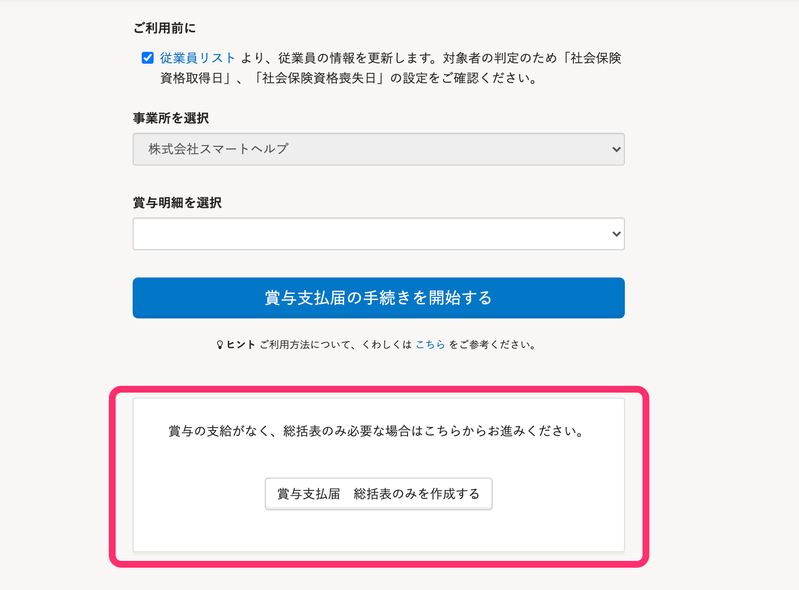
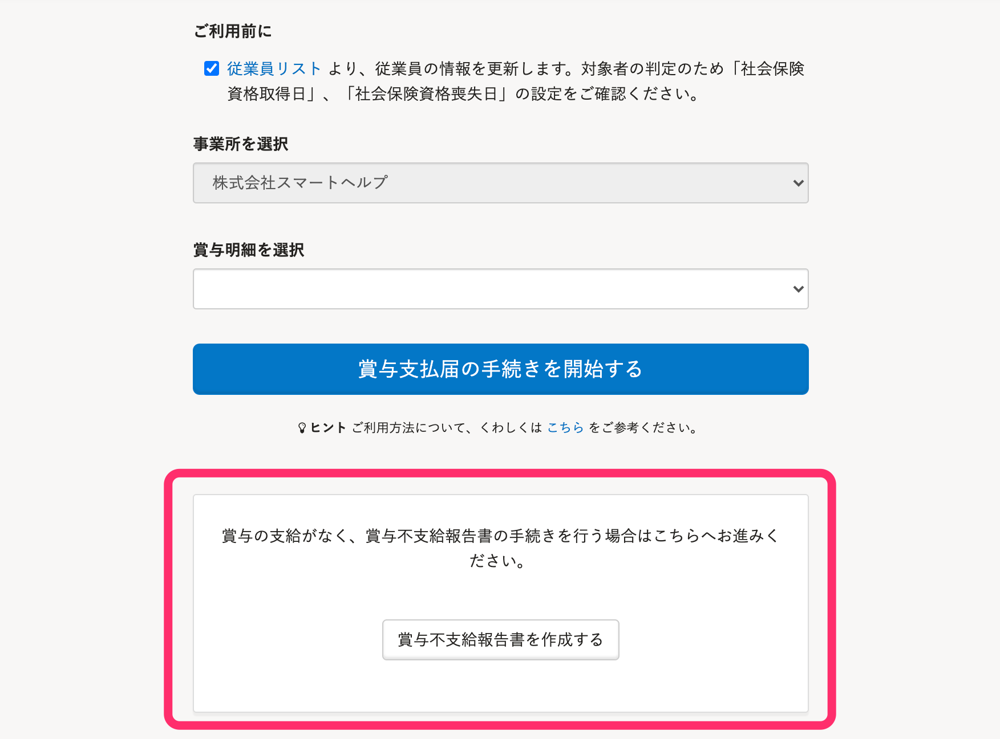

2021年6月11日（金）に行なったアップデートの詳細をお知らせします。

SmartHR基本機能の変更点は、新機能1件・不具合修正2件でした。

# ✨ 新機能

## 賞与支払届で作成される書類をリニューアルしました

令和3年4月1日から、賞与支払届総括表の廃止、賞与不支給報告書の新設という厚生労働省の発表を受け、賞与支払届で作成される書類を下記のとおりリニューアルしました。

- 賞与支払届総括表の書類作成・電子申請機能の廃止
- 賞与不支給報告書の書類作成・電子申請機能の追加

:::related
[\[6/14更新\]算定基礎届・賞与支払届の総括表を廃止し、賞与不支給報告書を新設します](https://smarthr.jp/update/23748)
:::

これまであった賞与支払届総括表の作成ボタンを廃止して、賞与不支給報告書の作成ボタンを新設しました。

| 変更前 | 変更後 |
| --- | --- |
|  |  |

# 👨‍⚕️ 不具合修正

従業員リストのダウンロード対象範囲を **［従業員情報+家族情報］** に設定した際の挙動に関する修正など、2件の不具合修正を行ないました。
