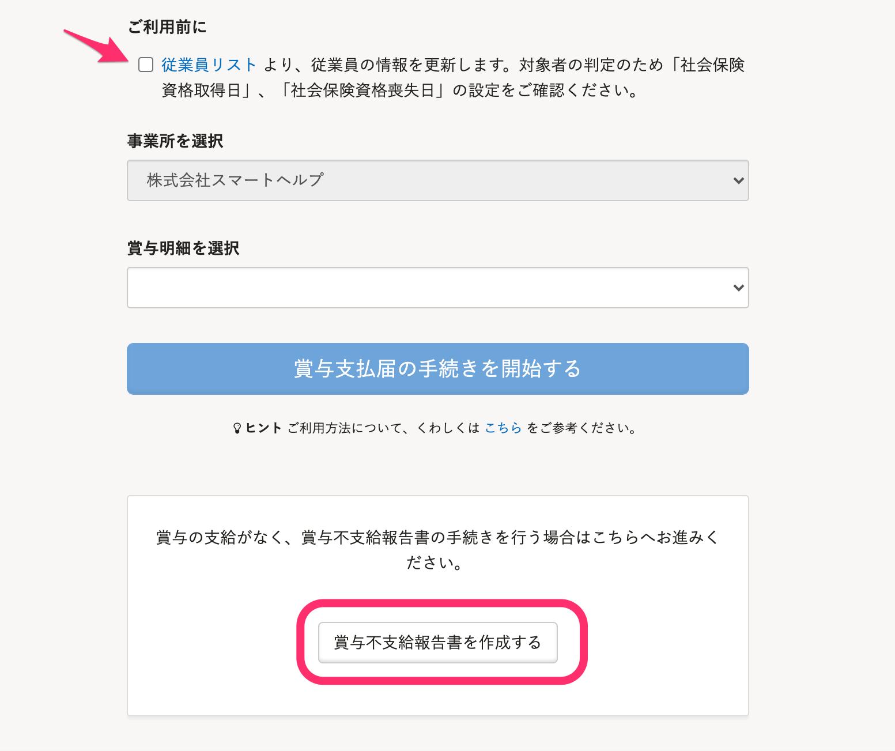
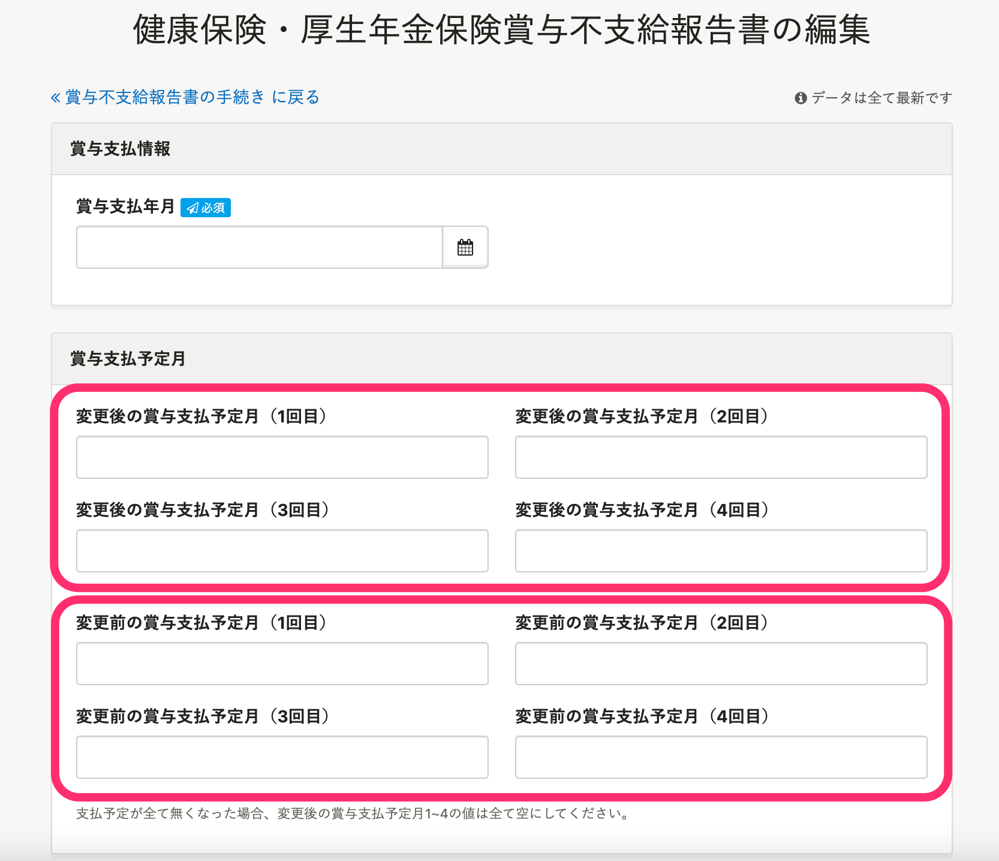
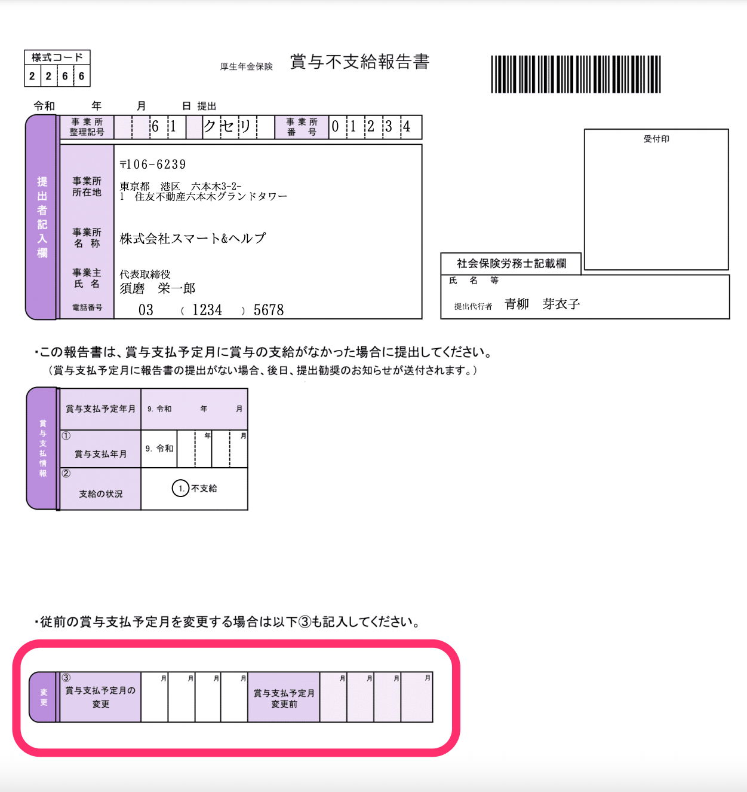

2021年6月17日（木）に行なったアップデートの詳細をお知らせします。

SmartHR基本機能の変更点は、カイゼン3件・不具合修正1件でした。

# 📈 カイゼン

## 賞与不支給報告書を作成する際の動作と書類編集画面を変更しました

賞与不支給報告書を作成する際の動作と、賞与不支給報告書の書類編集画面の配置を、以下のとおり変更しました。

- 賞与不支給報告書を作成する際に、 **［ご利用前に］** のチェックボックスの状態に関係なく、 **［賞与不支給報告書を作成する］** をクリックできるようにしました。

- 賞与不支給報告書の編集画面の **［賞与支払予定月］** の入力欄を、賞与不支給報告書の書類上の順番に合わせました。

**賞与不支給報告書の編集画面**

**賞与不支給報告書**

## 従業員リストのフリーワード検索表示を高速化しました

従業員リストでフリーワード検索した際に検索結果が遅いことがあったため、内部動作を見直し検索表示をカイゼンしました。

## 取り込んだ画像ファイルのURLを変更しました

取り込んだプロフィール画像や口座情報を確認できる画像類のファイルのURLを変更しました。

画面上の変更はありませんが、公開APIから参照できる画像類のURLで変更が確認できます。

# 👨‍⚕️ 不具合修正

申請フォーム編集の際の挙動に関する1件の不具合修正を行ないました。
