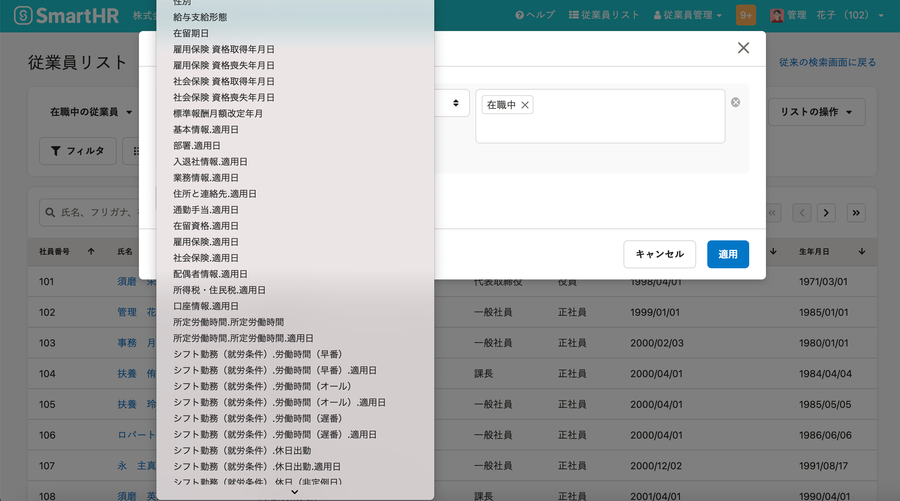
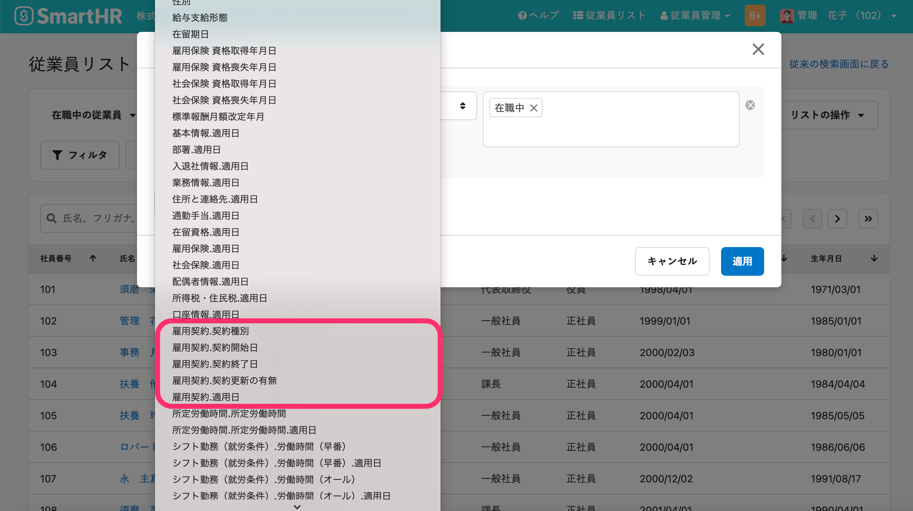
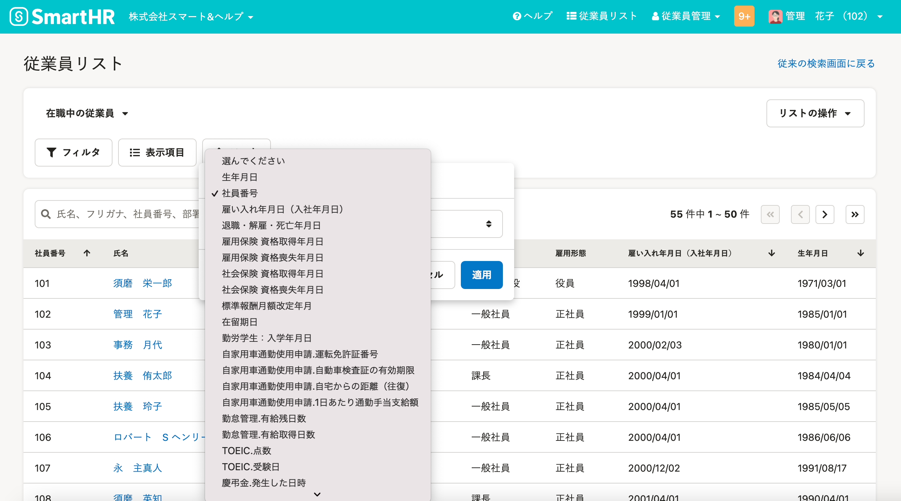
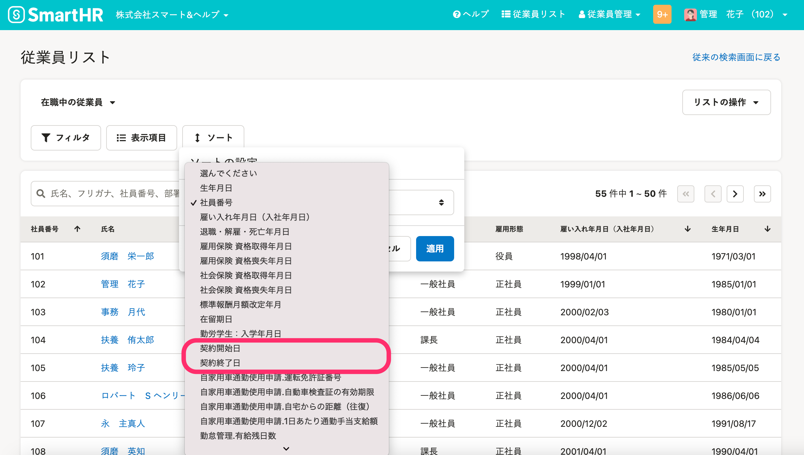

2021年6月22日（火）に行なったアップデートの詳細をお知らせします。

SmartHR基本機能の変更点は、カイゼン1件・不具合修正1件でした。

# 📈 カイゼン

## 従業員リストを［雇用契約情報］で絞り込めるようにしました

従業員リストのフィルタとソート条件に、 **［雇用契約情報］** に関する項目を追加しました。

有期雇用契約の更新業務など、契約状況を確認する際にご活用ください。

-  **［フィルタ］** の条件項目： **［契約種別］［契約開始日］［契約終了日］［契約更新の有無］** 
-  **［ソート］** の条件項目： **［契約開始日］［契約終了日］** 

フィルタ

| 変更前 | 変更後 |
| --- | --- |
|  |  |

ソート

| 変更前 |   |
| --- | --- |
|  |  |

# 👨‍⚕️ 不具合修正

「雇用保険被保険者転勤届」の変更前氏名フリガナ欄に関する1件の不具合修正を行ないました。
