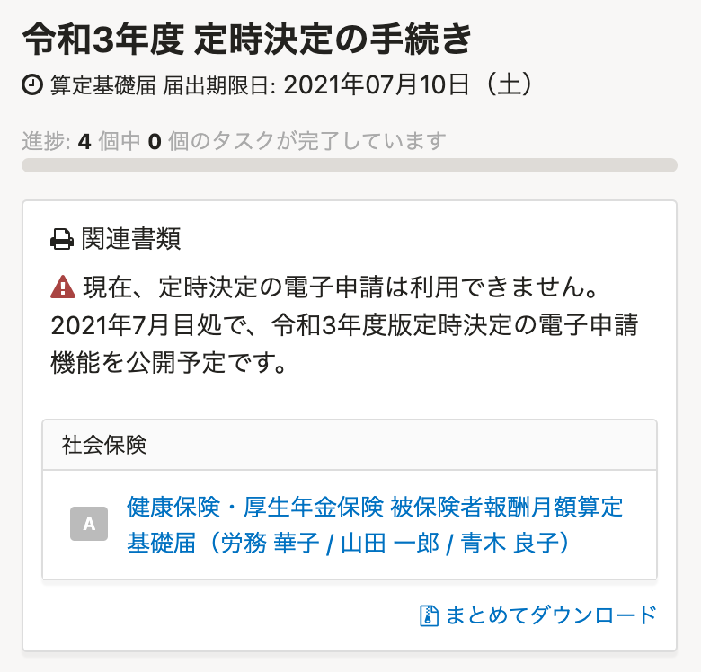
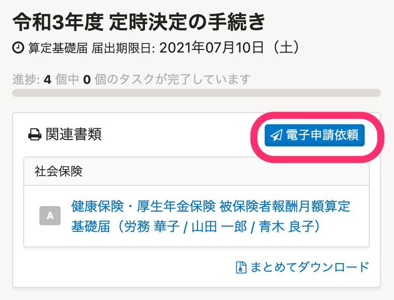

2021年6月30日（水）に行なったアップデートの詳細をお知らせします。

SmartHR基本機能の変更点は、新機能1件でした。

# ✨ 新機能

## 令和3年度の定時決定の手続きの電子申請機能を公開しました

:::related
[【令和3年度の電子申請】年度更新は6月1日（火）、定時決定は7月1日（木）に提供予定です](https://smarthr.jp/update/24869)
:::

7月1日より、令和3年度の定時決定の手続きで「健康保険・厚生年金保険 被保険者報酬月額算定基礎届」の電子申請ができるようになったため、 **［電子申請依頼］** ボタンを表示させ、電子申請依頼の実行に進めるようにしました。

| 変更前 | 変更後 |
| --- | --- |
|  |  |

:::related
[対象となる従業員を自動判定して定時決定の手続きをする](https://knowledge.smarthr.jp/hc/ja/articles/360026265793)
[CSV形式の算定基礎届を取り込んで定時決定の手続きをする](https://knowledge.smarthr.jp/hc/ja/articles/360049895434)
:::
