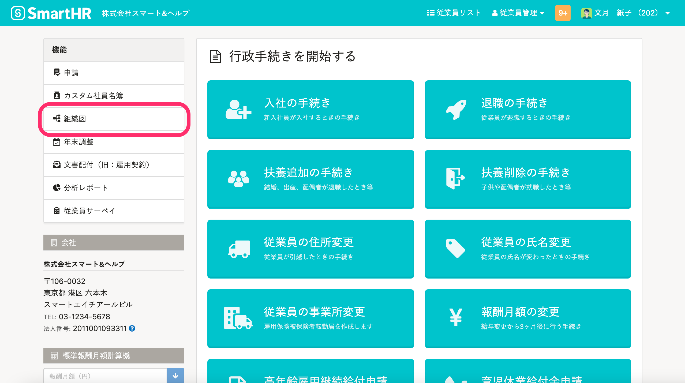

2021年7月1日（木）に行なったアップデートの詳細をお知らせします。

SmartHR基本機能の変更点は、新機能1件・不具合修正2件でした。

# ✨ 新機能

## 管理者以外も［組織図］機能にアクセスできるようにしました

これまでは管理者の画面のみ **［組織図］** 機能を表示していましたが、従業員画面にも表示し、従業員も **［組織図］** にアクセスできるようにしました。

閲覧できる組織図がない場合は、組織図のトップ画面に **［閲覧できる組織図はありません］** と表示されます。

# 👨‍⚕️ 不具合修正

CSVファイルを取り込んで定時決定手続きをした際の電子申請の挙動に関する修正など、2件の不具合修正を行ないました。
