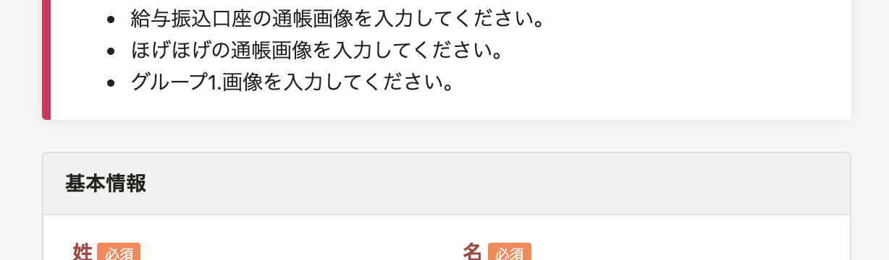
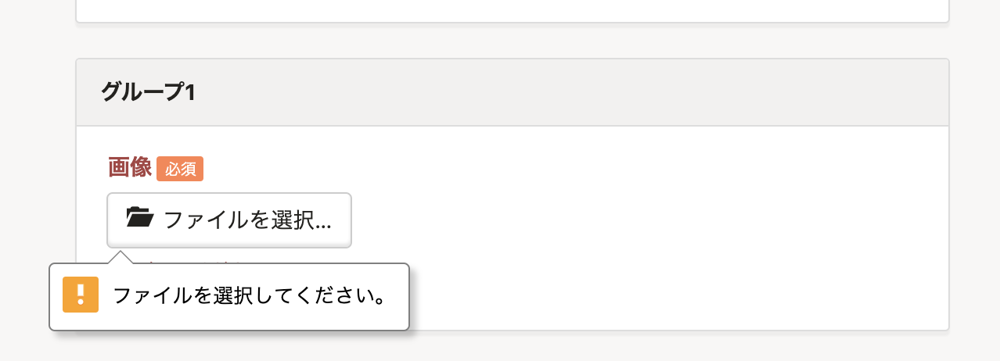

2021年7月7日（水）に行なったアップデートの詳細をお知らせします。

SmartHR基本機能の変更点は、カイゼン1件でした。

# 📈 カイゼン

## 一部のスマホブラウザで表示されていなかった、招待フォームの必須項目に未入力がある場合のエラーメッセージを表示するようにしました

これまで、一部のスマホブラウザで招待フォームに入力する際、カスタム項目に未入力のものがあっても画面上に何のエラーも出ず、操作に迷うことがありました。

そのため、当該ブラウザで必須のカスタム項目を未入力の状態で送信した場合に、画面上部にエラーメッセージを表示するようにしました。

当該ブラウザ以外のブラウザでは、これまで同様、対象項目にエラーメッセージを表示します。

