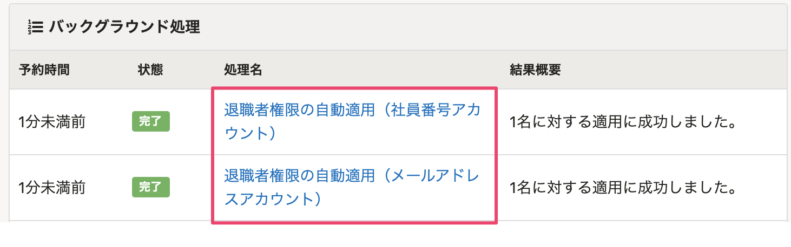

2021年7月9日（金）に行なったアップデートの詳細をお知らせします。

SmartHR基本機能の変更点は、カイゼン1件・不具合修正1件でした。

# 📈 カイゼン

## 自動的に退職者権限にした際のバックグラウンド処理の文言を変更しました

退職日を迎えたアカウントを退職者権限にした際のバックグラウンド処理の処理名を **［退職者権限の自動変更］** としていましたが、実際の処理と異なる表現になっていたため、 **［退職者権限の自動適用］** に変更しました。

# 👨‍⚕️ 不具合修正

入社手続きで従業員情報を入力する際のエラーメッセージに関する1件の不具合修正を行ないました。
