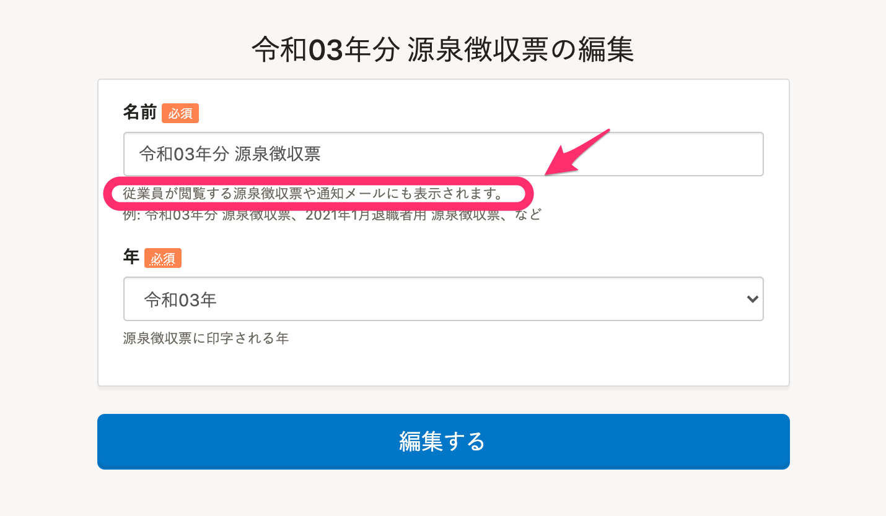
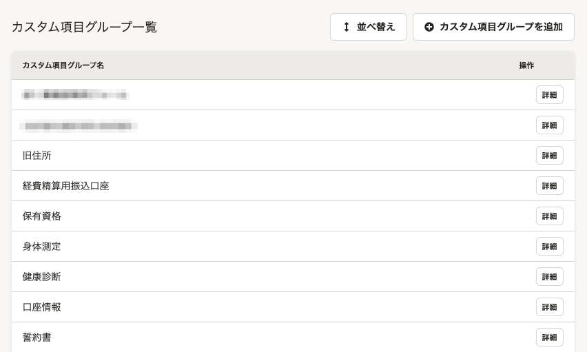
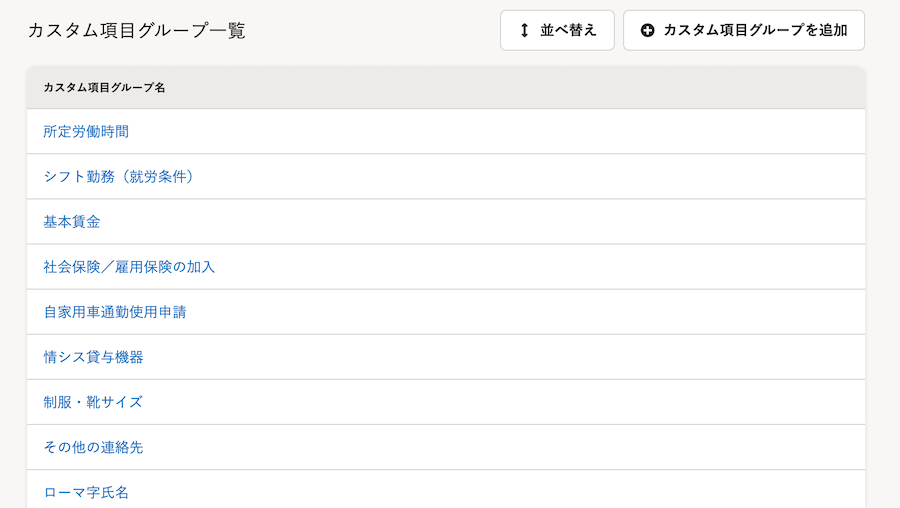

2021年7月19日（月）に行なったアップデートの詳細をお知らせします。

SmartHR基本機能の変更点は、新機能1件・カイゼン3件・不具合修正2件でした。

# ✨ 新機能

## 家族情報に［家族コード］を追加しました

これまでは、外部システムに家族情報を連携する際に、家族情報の項目として固有の値（IDやコード）を管理できなかったため、別途IDやコードを手作業でおぎなう必要がありました。

そのため今回のリリースで、家族情報に **［家族コード］** という任意項目を追加し、外部システムと連携しやすくしました。

:::related
[家族情報に新項目「家族コード」を追加しました](https://smarthr.jp/update/25751)
[家族情報を追加・編集・削除する](https://knowledge.smarthr.jp/hc/ja/articles/360035423833)
:::

 **［家族情報］ > ［基本情報］** から設定できます。

# 📈 カイゼン

## 源泉徴収票作成・編集画面の［名前］の説明文を変更しました

源泉徴収票作成・編集画面の **［名前］** の下にある説明文を **［源泉徴収票の管理用の名前を入力します。］** から、従業員へのメールや従業員ページでも表示されることがわかるように、 **［従業員が閲覧する源泉徴収票や通知メールにも表示されます。］** に変更しました。

「管理用」という言葉が、従業員には表示されない「名前」だと誤解を与えてしまうことがあったため、適切な表現に変更しました。

## 給与明細のフリーワード検索の速度をカイゼンしました

給与明細一覧でフリーワード検索した際にタイムアウトすることがありましたが、内部動作を見直し、フリーワード検索の速度をカイゼンしました。

## カスタム従業員項目の詳細画面への動線UIを変更しました

カスタム従業員項目の一覧表示のルールを、[SmartHR Design Systemの一覧表示パターン](https://smarthr.design/products/design-guide/smarthr-table)に合わせて、 **［詳細］** ボタンから詳細画面へ移動する仕様から、カスタム項目グループ名をクリックして詳細画面へ移動するUIに変更しました。

また、SmartHR全体のガイドラインに合わせて、0件表示の際の文言を一部修正しました。

| 変更前 | 変更後 |
| --- | --- |
|  |  |

# 👨‍⚕️ 不具合修正

給与明細を取り込む際の画面表示に関する修正など、2件の不具合修正を行ないました。
