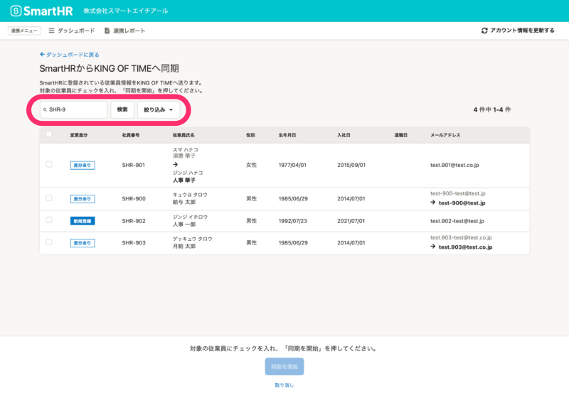
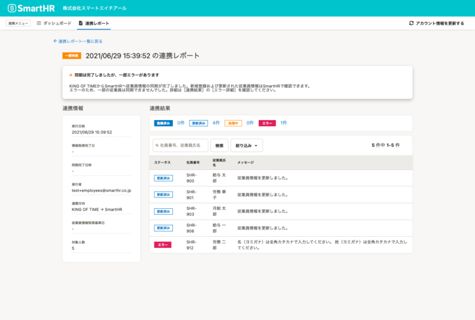
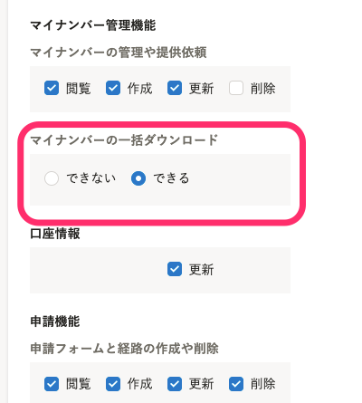

2021年7月20日（火）に行なったアップデートの詳細をお知らせします。

SmartHR基本機能の変更点は、新機能1件・カイゼン2件・不具合修正1件でした。

# ✨ 新機能

## KING OF TIME連携機能をリニューアルしました

新しいKING OF TIME連携機能では、以下の機能を追加しました。

- 従業員一覧画面の **検索機能** と **変更差分での絞り込み機能**
- 連携結果やエラー内容を確認できる **［連携レポート］機能** 

また、SmartHR全体のデザインにあわせて連携画面のデザインをリニューアルしました。

詳しくは、下記のお知らせをご覧ください。

[KING OF TIME連携アプリをリニューアルしました｜SmartHR](https://smarthr.jp/update/26547)

:::tips
リニューアルしたKING OF TIME連携機能を利用するには、 **［共通設定］>［アプリケーション連携］** からKING OF TIME連携を再インストールしてください。
[SmartHRオプション機能をインストールする](https://knowledge.smarthr.jp/hc/ja/articles/360026262553)
:::

**従業員一覧画面**

 **［連携レポート］画面** 

:::related
[【KING OF TIME】従業員情報を連携する](https://knowledge.smarthr.jp/hc/ja/articles/4403626515225)
:::

# 📈 カイゼン

## メール通知の内部動作をカイゼンしました

メール通知をする際の内部動作を最適化し、メール通知の速度をカイゼンしました。

## マイナンバーの一括ダウンロード権限を新たに追加しました

これまでは、マイナンバーの閲覧権限があれば一括ダウンロードが可能でしたが、「一括ダウンロードは限られた従業員にのみ許可したい」という声をいただいておりました。

そこで、今回のリリースで、マイナンバーの一括ダウンロード権限を追加しました。

一括ダウンロード権限があるアカウントのみ、マイナンバーが一括ダウンロードできるようにしました。

詳しくは、下記のお知らせをご覧ください。

[【マイナンバー管理機能】マイナンバーの一括ダウンロード権限を新設しました｜SmartHR](https://smarthr.jp/update/26906)

:::related
[マイナンバーを一括ダウンロードする](https://knowledge.smarthr.jp/hc/ja/articles/360026106654)
:::

# 👨‍⚕️ 不具合修正

手続きを作成したあとに会社情報を変更した場合の、従業員情報の表示に関する修正を行ないました。
