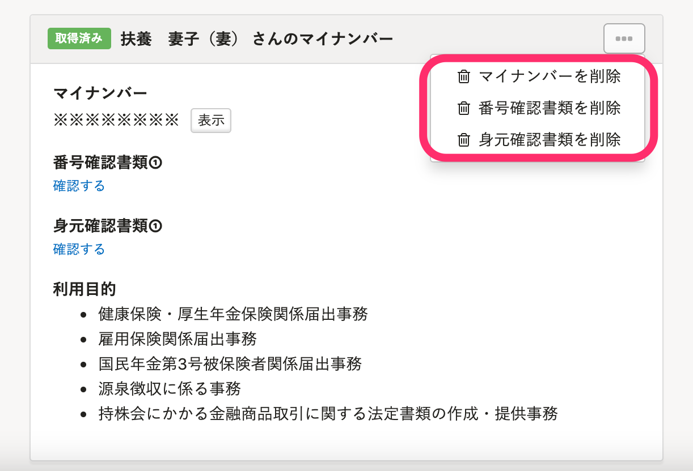

2021年7月28日（水）に行なったアップデートの詳細をお知らせします。

SmartHR基本機能の変更点は、新機能1件・不具合修正1件でした。

# ✨ 新機能

## マイナンバーの［番号確認書類］［身元確認書類］を削除できるようにしました

これまではマイナンバーの削除のみ可能でしたが、マイナンバーの番号確認書類と身元確認書類も削除できるようにしました。

これにより、マイナンバーの確認後は、速やかに番号確認書類・身元確認書類のみを破棄できるようになります。

:::related
[マイナンバーの番号確認書類・身元確認書類を削除する](https://knowledge.smarthr.jp/hc/ja/articles/4404156802457)
:::

# 👨‍⚕️ 不具合修正

SmartHRからログアウトした際の新KING OF TIME連携機能の挙動に関する1件の不具合修正を行ないました。
