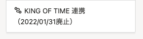
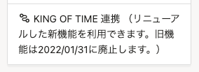

2021年7月29日（木）に行なったアップデートの詳細をお知らせします。

SmartHR基本機能の変更点は、カイゼン1件・不具合修正1件でした。

# 📈 カイゼン

## 旧KING OF TIME 連携のメニュー文言を変更しました

トップページの機能欄にある旧 KING OF TIME 連携の説明文が、KING OF TIMEの連携自体が廃止されるという誤解を与えることがあったため、メニューの文言を下図のとおり変更しました。

| 変更前 | 変更後 |
| --- | --- |
|  |  |

:::related
[KING OF TIME連携アプリをリニューアルしました｜SmartHR](https://smarthr.jp/update/26547)
:::

# 👨‍⚕️ 不具合修正

申請一覧のCSVダウンロードに関する1件の不具合修正を行ないました。
