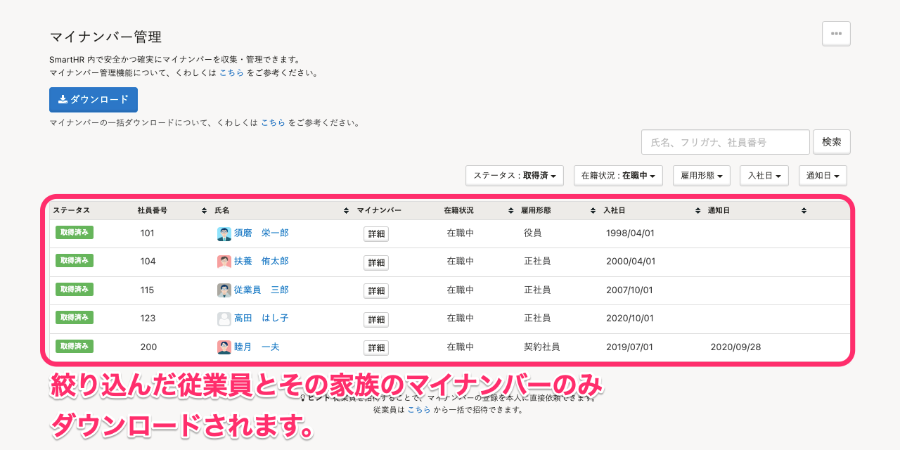

2021年7月30日（金）に行なったアップデートの詳細をお知らせします。

SmartHR基本機能の変更点は、カイゼン2件でした。

# 📈 カイゼン

## 特定の従業員に絞ってマイナンバーを一括ダウンロードできるようにしました

これまでは、 **［ダウンロード］** をクリックすると、すべての従業員とその家族のマイナンバーがダウンロードされていました。

今回のリリースで、検索やフィルター条件で絞りこんだ従業員とその家族のマイナンバーのみをダウンロードできるようにしました。

これにより、必要なマイナンバーのみをダウンロードできるようになります。

:::related
[マイナンバーを一括ダウンロードする](https://knowledge.smarthr.jp/hc/ja/articles/360026106654)
:::

## 育児休業給付金申請の手続きで、通帳・キャッシュカードの画像添付を任意項目にしました

厚生労働省より、令和3年8月1日から育児休業給付金申請の手続きで、通帳等の写しが原則不要となるお知らせを受け、下記の対応を行ないました。

-  **［給付金を受け取る金融機関］>［通帳・キャッシュカードの画像］** を 必須項目から任意項目に変更
- 育児休業給付受給資格確認票・（初回）育児休業給付金支給申請を電子申請した際の、通帳・キャッシュカードの画像の自動添付を廃止
    

詳しくは、下記のお知らせをご覧ください。

[8月1日より育児休業給付金等の手続の際、通帳等の写しが原則不要となります](https://smarthr.jp/update/26916)
