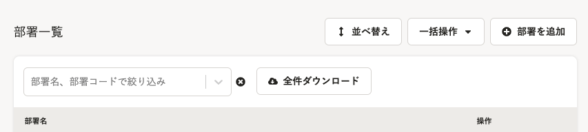
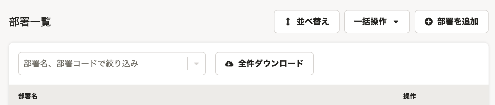
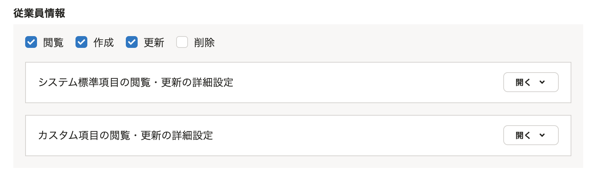
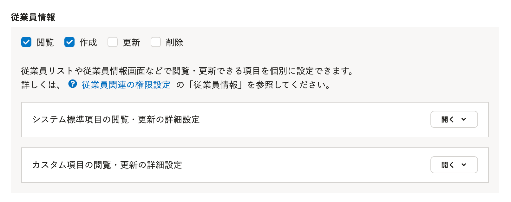
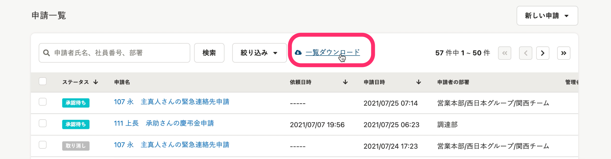

2021年8月3日（火）に行なったアップデートの詳細をお知らせします。

SmartHR基本機能の変更点は、新機能1件・カイゼン4件でした。

# ✨ 新機能

## チャットボットの仕組みを変更しました

これまで提供していたチャットボットは、チャットボットを開き、該当するお問い合わせをクリックしていくことで回答が表示される「シナリオ型」の仕様でした。

今回のリリースから、メッセージ入力欄にお問い合わせ内容を入力することで、回答が直接表示される「AI型」になりました。

年末調整機能、文書配付機能などは、順次切り替えを予定しております。

詳しくは、下記のお知らせをご覧ください。

[【8/2追記】チャットボットの仕組みを変更します](https://smarthr.jp/news/27115)

# 📈 カイゼン

## 部署一覧の検索ボックスを新しいデザインにしました

部署一覧にある検索ボックスを、SmartHR全体のデザインにあわせて新しくしました。

| 変更前 | 変更後 |
| --- | --- |
|  |  |

## 氏名が登録されている場合、SmartHRからのメールに氏名を表示するようにしました

これまでは、従業員情報の氏名が登録されていても、メールの文面ではメールアドレスが表示されている場合がありました。

今回のカイゼンで、氏名が登録されていれば氏名を表示するようにしました。。

氏名が登録されていない場合は、これまで通りメールアドレスが表示されます。

## 従業員情報の権限設定欄に説明文を追記しました

 **［権限］>［従業員情報］** の設定画面に、従業員情報を項目単位で設定する際の説明文を追記し、[従業員関連の閲覧・作成・更新・削除の権限を設定する](https://knowledge.smarthr.jp/hc/ja/articles/1500001368101) というヘルプページへの導線も設置しました。

| 変更前 | 変更後 |
| --- | --- |
|  |      |

## 申請一覧の［一覧ダウンロード］にカーソルを置くと指カーソルになるようにしました

申請一覧画面の **［一覧ダウンロード］** のリンクにカーソルを置いた際に、指カーソルになるように変更しました。

また同リンクをクリックすると、ダウンロードが予約されたことがわかるように、 **［一覧ダウンロードを予約しました］** のパネルが表示される画面上部へスクロールするようにしました。

