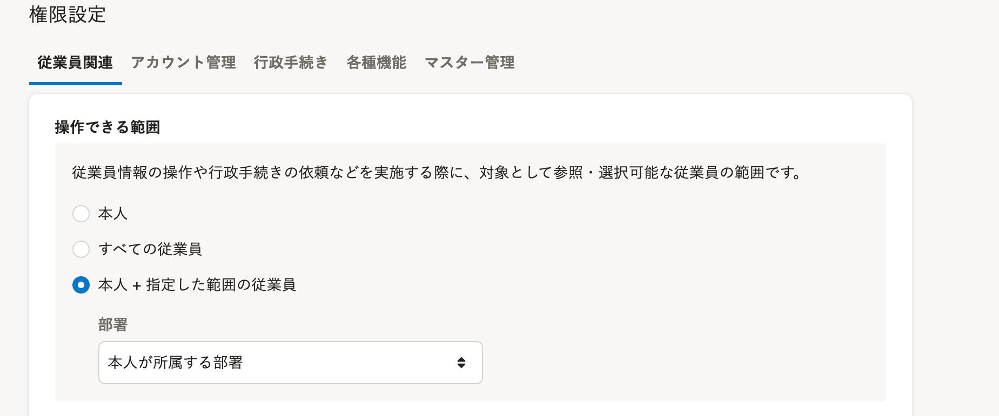
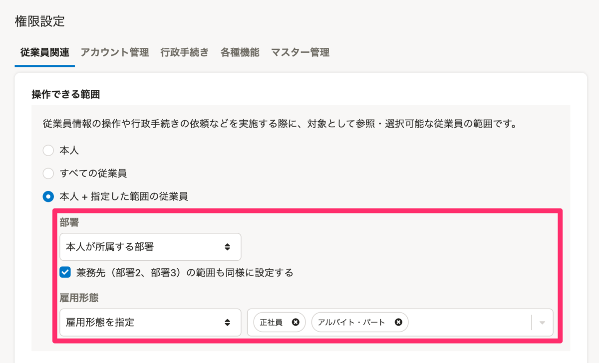

2021年8月4日（水）に行なったアップデートの詳細をお知らせします。

SmartHR基本機能の変更点は、新機能1件でした。

# ✨ 新機能

## 権限の［操作できる範囲］で、兼務先の部署も範囲に含められるようにしました

これまでは、権限設定の **［従業員関連］>［操作できる範囲］** で **［本人＋指定した範囲の従業員］** を選択した場合、部署情報の部署1のみが範囲の対象でした。

今回のリリースから、部署2、部署3も登録されている場合は、その兼務先の部署も操作できる範囲に含めるかどうかを設定できるようにしました。

あわせて、雇用形態を絞った指定にも対応しています。

:::related
[【権限管理機能】操作できる従業員の範囲を詳細に設定できるようになります](https://smarthr.jp/update/25870)
:::

| 変更前 | 変更後 |
| --- | --- |
|      |  |
