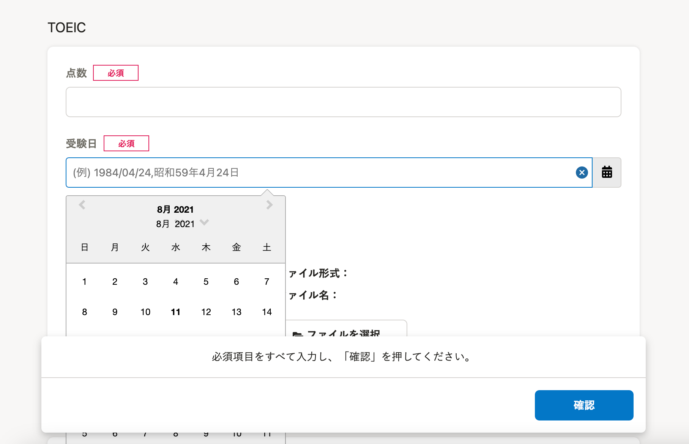
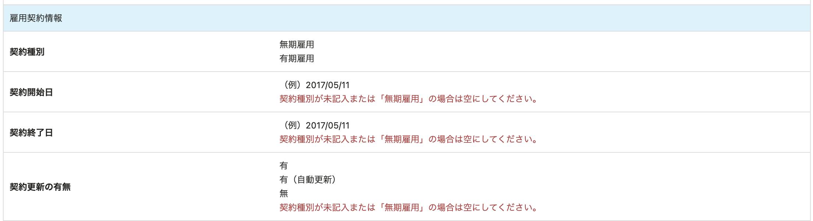

2021年8月10日（火）に行なったアップデートの詳細をお知らせします。

SmartHR基本機能の変更点は、カイゼン2件・不具合修正1件でした。

# 📈 カイゼン

## 申請フォームでカレンダーが隠れないようにしました

これまでは、申請フォームの日付を選択する項目でカレンダーを開くと、画面下にある確認欄に隠れてしまっていました。

そのため今回の改修で、カレンダーを上に表示するようにし、日付を選択しやすくしました。

ヘルプページのポップアップダイアログを表示している場合は、上から、ヘルプページ→カレンダー→確認欄の重なり順になります。

| 変更前 | 変更後 |
| --- | --- |
|  |  |

## 従業員の雇用契約情報に不整合な情報を登録できないようにしました

これまでは、雇用契約情報の **［契約種別］** が空欄や **［無期雇用］** でも、 **［契約開始日］［契約終了日］［契約更新の有無］** をCSV・APIで一括登録ができていました。

しかしこの仕様だと、不整合な情報で登録されることがあるため、今回のリリースで **［契約種別］** が **［有期雇用］** のときのみ、 **［契約開始日］［契約終了日］［契約更新の有無］** を一括更新できるようにしました。

CSV／XLSXファイルの凡例表にも注意書きを表示しています。

# 👨‍⚕️ 不具合修正

電子申請を送信した際の挙動に関する1件の修正を行ないました。
