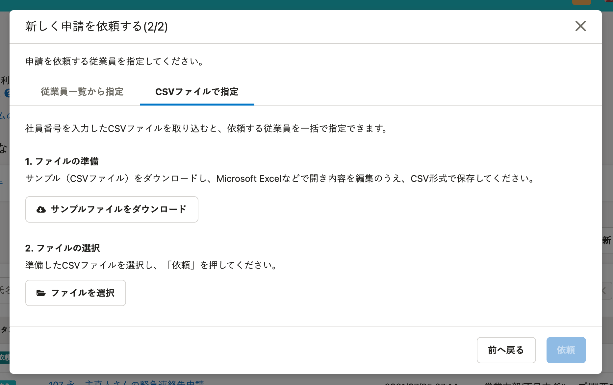

2021年8月13日（金）に行なったアップデートの詳細をお知らせします。

SmartHR基本機能の変更点は、新機能1件・不具合修正1件でした。

# ✨ 新機能

## 従業員への申請依頼をCSVファイルで指定できるようにしました

これまでは複数の従業員に申請を依頼する際に、画面に表示できる従業員数が限られていることや、複数部署などの細かい条件指定での絞り込みができませんでした。

そのため、申請の依頼が大量にある場合、操作に時間がかかることがありました。

今回のリリースで、CSVファイルで従業員を指定し、一括で依頼できるようにしました。

:::related
[【申請】CSVファイルで申請者を指定できるようになりました](https://smarthr.jp/update/27448)
[申請機能を使って従業員に情報提供を依頼する](https://knowledge.smarthr.jp/hc/ja/articles/360026103874)
:::

# 👨‍⚕️ 不具合修正

旧従業員リストで従業員情報をダウンロードする際の不具合を1件修正しました。
