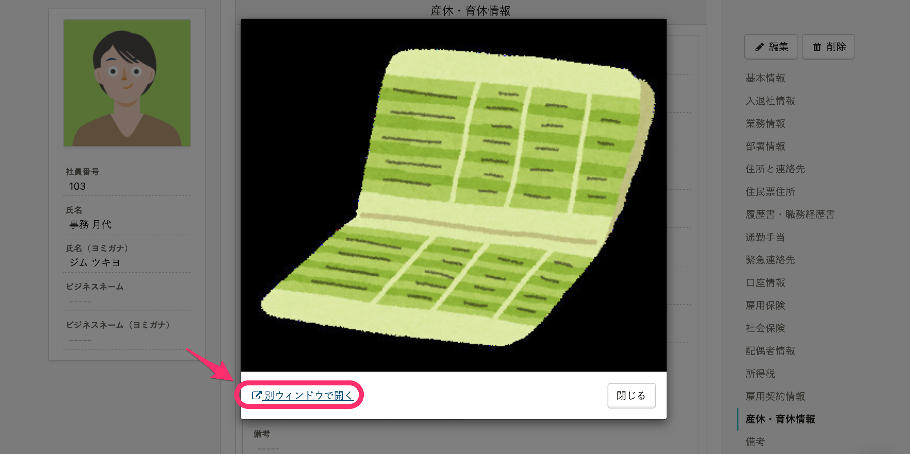

2021年8月16日（月）に行なったアップデートの詳細をお知らせします。

SmartHR基本機能の変更点は、カイゼン1件でした。

# 📈 カイゼン

## ［口座情報］［産休・育休情報］の画像を別ウィンドウで開けるようにしました

従業員詳細画面で **［口座情報］［産休・育休情報］** に登録している画像を、別ウィンドウで開くためのリンクを追加しました。

入力内容と照らし合わせながら、画像を確認できるようになります。

