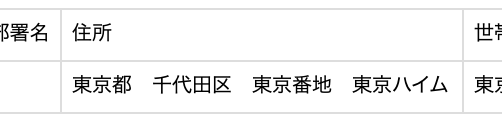
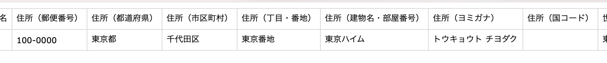

2021年8月17日（火）に行なったアップデートの詳細をお知らせします。

SmartHR基本機能の変更点は、カイゼン1件・不具合修正2件でした。

# 📈 カイゼン

## 申請内容を一括ダウンロードした際のCSVファイルの住所欄を分割しました

これまでは、申請一覧にある **［申請内容を一括ダウンロード］** をクリックした際、ダウンロードしたCSVファイルの住所欄に、住所に関する項目がすべてまとめて表示されていました。

しかしこの仕様だと、従業員リストのCSVファイルの形式と異なるため、今回の改修で、住所欄を従業員リストのCSVと同様に分割するようにしました。

申請フォームに、住所・住民票住所・緊急連絡先住所が含まれている場合になります。

あわせて、郵便番号も表示するようにしました。

| 変更前 | 変更後 |
| --- | --- |
|  |  |

# 👨‍⚕️ 不具合修正

氏名変更手続きの際に従業員側で修正できる範囲に関する修正など、2件の不具合修正を行ないました。
