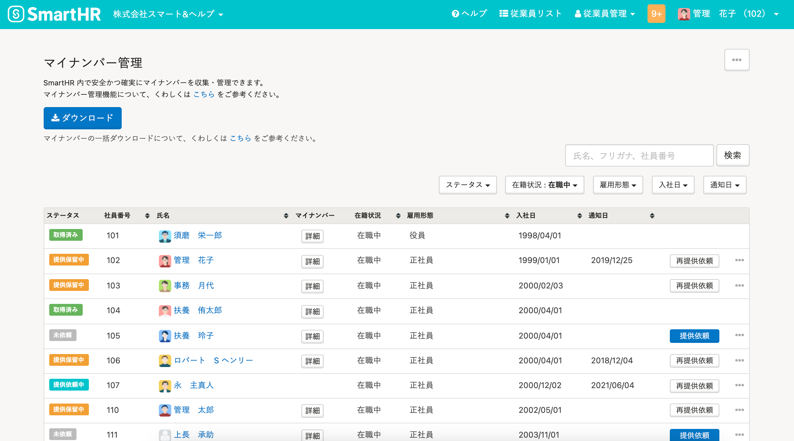
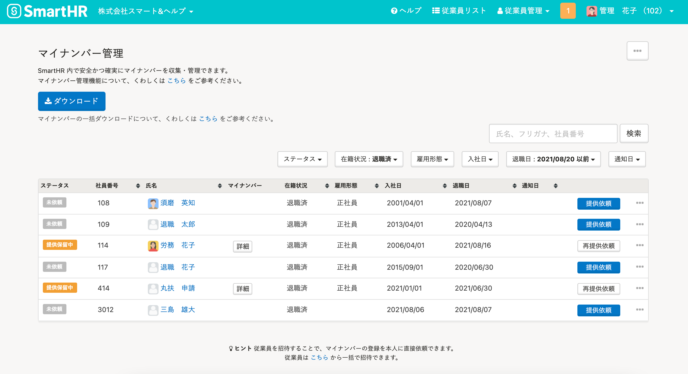
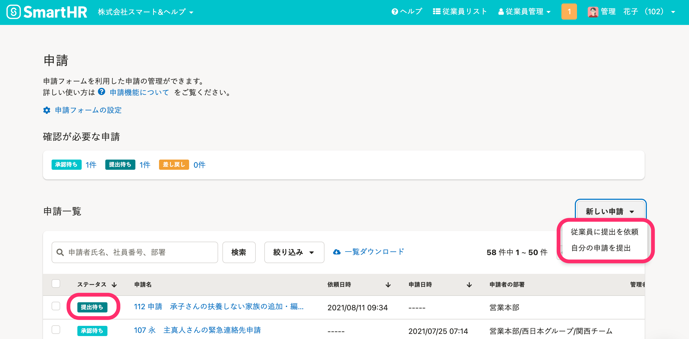
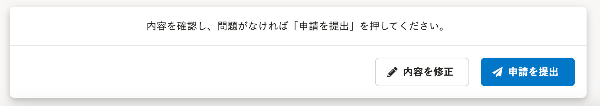
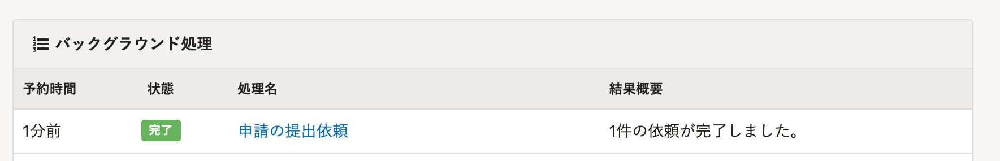
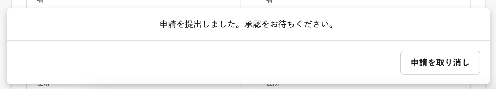
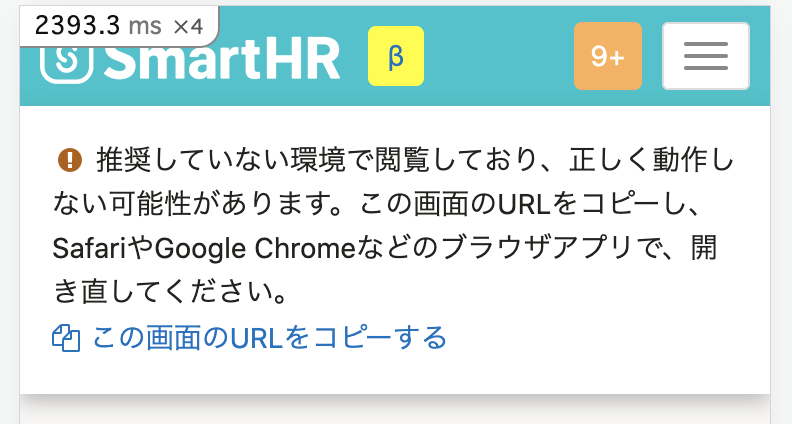

2021年8月18日（水）に行なったアップデートの詳細をお知らせします。

SmartHR基本機能の変更点は、新機能1件・カイゼン2件・不具合修正1件でした。

# ✨ 新機能

## マイナンバー管理画面の一覧を退職日で絞りこめるようにしました

マイナンバー管理画面の一覧を退職日で絞り込めるようにしました。

「マイナンバーが業務上不要（＝従業員が退職）になってから◯年」という、マイナンバー管理の実務にあわせた対応になります。

 **［退職日］>［日付で絞り込む］** をクリックすると、指定した日付以前に退職した従業員に絞って表示できます。

| 変更前 | 変更後 |
| --- | --- |
|  |  |

# 📈 カイゼン

## 申請機能の文言を見直しました

申請機能の文言を、下記のとおり変更しました。

1\. 申請ステータス名を **［申請依頼中］→［提出待ち］** に変更し、従業員視点でも申請状況がわかるようにしました。

あわせて **［ 新しい申請を作成する］** の操作名を下記のとおり変更しました。

-  **［従業員に申請を依頼する］→［従業員に提出を依頼］** 
-  **［自分の申請を行う］→［自分の申請を提出］** 

上記に揃えて、申請内容の確認画面にある **［申請を送信］→［申請を提出］** に変更しました。

2\. 「申請」という文言の扱い方を見直し、動詞的に使用しているものを下記のとおり変更しました。

- 例：バックグラウンド処理画面 **［申請依頼］→［申請の提出依頼］** 
- 例：申請を提出した画面 **［申請しました］→［申請を提出しました］** 

## アプリ内ブラウザでSmartHRを開く場合に、通常のブラウザで開くように促すメッセージを表示するようにしました

メールアプリなどのアプリ内ブラウザでSmartHRを開くと、一部正常に動作しないことがありました。

そのため今回の修正で、アプリ内ブラウザで開こうとした場合は、通常のブラウザで開くように促すメッセージを表示するようにしました。

# 👨‍⚕️ 不具合修正

配偶者の扶養追加手続きをする際に年間所得見積額が一定額以上になった場合の挙動に関する修正など、1件の不具合修正を行ないました。
