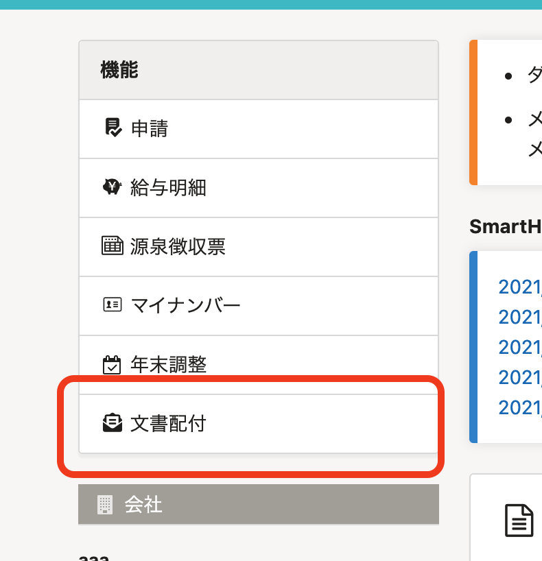
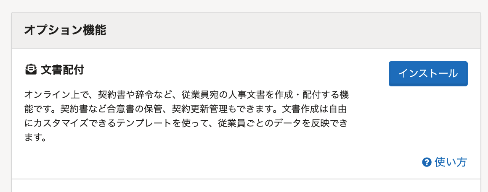

2021年8月23日（月）に行なったアップデートの詳細をお知らせします。

SmartHR基本機能の変更点は、カイゼン1件・不具合修正2件でした。

# 📈 カイゼン

## ［文書配付（旧：雇用契約）］の機能名を［文書配付］にしました

 **［雇用契約］** から **［文書配付］** への機能名の変更が浸透したため、 **［文書配付］** の末尾についていた **［（旧：雇用契約）］** を削除しました。

# 👨‍⚕️ 不具合修正

賞与支払届・定時決定手続きの書類をまとめてダウンロードした際の挙動に関する修正など、2件の不具合修正を行ないました。
