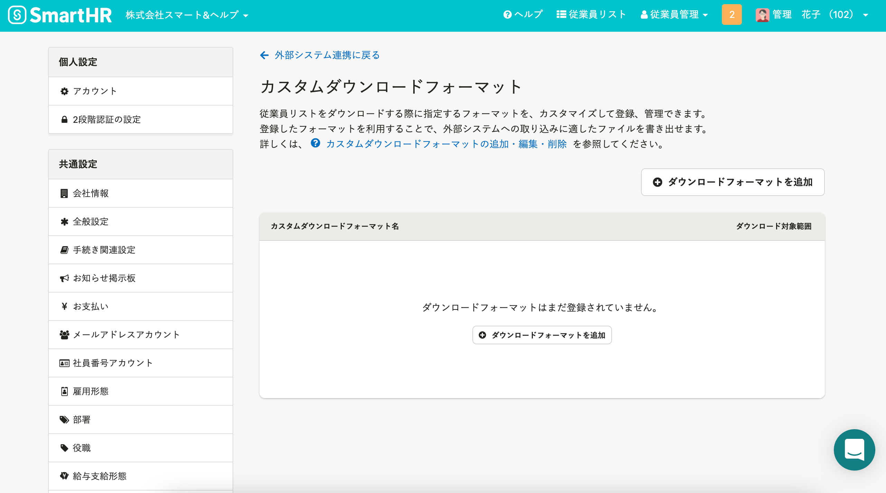

2021年8月24日（火）に行なったアップデートの詳細をお知らせします。

SmartHR基本機能の変更点は、新機能1件でした。

# ✨ 新機能

## 従業員リストを外部システムに合わせたフォーマットでダウンロードできるようにしました

これまでは、従業員リストをダウンロードする際は、SmartHRが定めるフォーマットのみの対応でした。

しかしこの仕様では、外部システムへ従業員情報を連携する際に、そのインポート形式に合わせた変換作業が必要になっていました。

そのため今回のリリースにより、従業員リストをダウンロードする際に指定する **［ダウンロードフォーマット］** をカスタマイズできるようにしました。

登録したフォーマットを利用して、外部システムへの取り込みに適したファイルを、CSV形式またはExcel形式（.xlsx）でダウンロードできます。

詳しくは、下記のお知らせの「一次リリースの機能詳細」をご覧ください。

[【CSV連携】従業員リストを他システムに合わせたフォーマットでダウンロードできるようになります](https://smarthr.jp/update/27126)

:::related
[カスタムダウンロードフォーマットの追加・編集・削除](https://knowledge.smarthr.jp/hc/ja/articles/4404850299289)
[Q. カスタムダウンロードフォーマットのダウンロード項目一括追加用のCSVファイルの書き方は？](https://knowledge.smarthr.jp/hc/ja/articles/4404850250265)
:::

 **［カスタムダウンロードフォーマット］** 画面には、画面右上の **［アカウント名▼］** \> **［共通設定］** \> **［外部システム連携］>［CSV連携］** の **［カスタムダウンロードフォーマット］** からアクセスできます。

:::tips
この機能（CSV連携機能）は、スタンダードプラン以上でご利用いただけます。
:::
