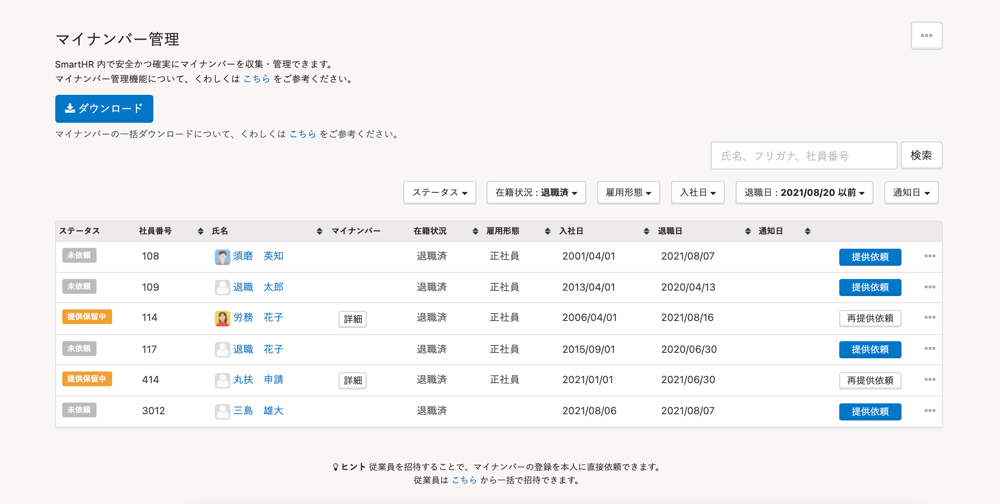
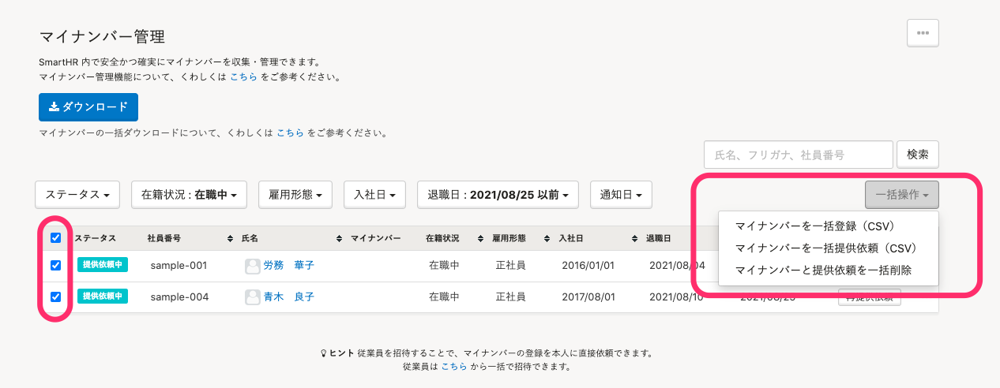

2021年8月25日（水）に行なったアップデートの詳細をお知らせします。

SmartHR基本機能の変更点は、新機能1件・不具合修正3件でした。

# ✨ 新機能

## マイナンバーを一括削除できるようにしました

これまでは保管期間を過ぎたマイナンバーや、誤ってマイナンバーを一括登録してしまった際など、マイナンバーを大量に登録している場合でも1つずつ削除する必要がありました。

そのため今回のリリースにより、マイナンバー管理画面に **［一括操作］>［マイナンバーと提供依頼を一括削除］** のメニューを追加し、マイナンバーを一括削除できるようにしました。

チェックを入れた従業員とその家族のマイナンバーを一括削除できます。

:::related
[マイナンバーを削除する](https://knowledge.smarthr.jp/hc/ja/articles/360054037573)
:::

こちらのリリースにあわせて、以下の対応も行なっています。

-  **［一括操作］** に一括操作のメニュー（ **［マイナンバーを一括登録（CSV）］［マイナンバーを一括提供依頼（CSV）］［マイナンバーと提供依頼を一括削除］** ）を集約
- 一覧上部にある **［ステータス］［在籍状況］［雇用形態］［入社日］［退職日］［通知日］** の配置位置とサイズを調整

| 変更前 | 変更後 |
| --- | --- |
|  |  |

# 👨‍⚕️ 不具合修正

カスタムダウンロードフォーマットのダウンロード項目の更新が失敗した際の挙動に関する修正など、3件の不具合修正を行ないました。
