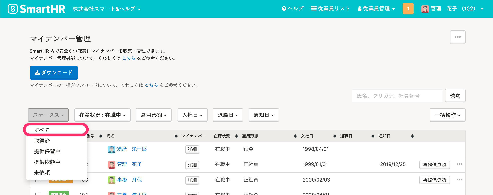

2021年8月27日（金）に行なったアップデートの詳細をお知らせします。

SmartHR基本機能の変更点は、カイゼン1件・不具合修正1件でした。

# 📈 カイゼン

## マイナンバー管理画面にある［全て］を［すべて］に変更しました

SmartHR全体の表記ルールにあわせて、マイナンバー管理画面にある **［ステータス］** メニューの **［全て］** を **［すべて］** に変更しました。

# 👨‍⚕️ 不具合修正

トライアル終了の際に表示される料金プラン一覧に関する1件の不具合修正を行ないました。
