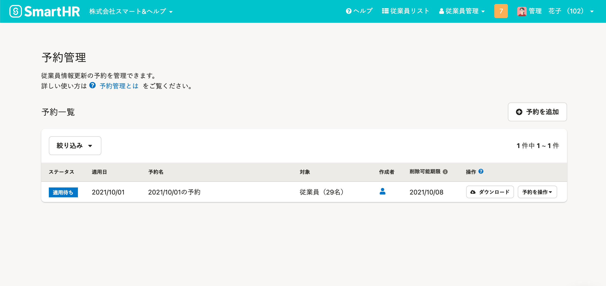
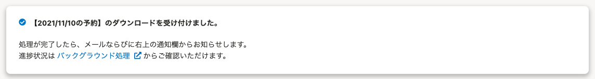
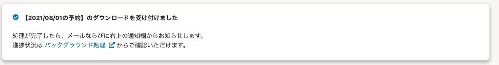

2021年9月1日（水）に行なったアップデートの詳細をお知らせします。

SmartHR基本機能の変更点は、新機能1件・カイゼン1件・不具合修正1件でした。

# ✨ 新機能

## 未来の日付で従業員情報の更新を予約できるようにしました

これまでは従業員情報を更新する際、現在より過去の情報しか登録できませんでした。

そのため、部署の異動情報など、事前に分かっている情報の変更作業は当日まで待つ必要がありました。

今回のリリースで、従業員情報の更新を未来の日付で事前に予約できるようにしました。

指定した日付になると、自動で従業員情報が更新されます。

 **［従業員管理］>［予約管理］** から予約の確認・追加・削除ができます。

詳しくは、下記のお知らせをご覧ください。

[【予約管理機能】未来の日付で従業員情報を更新予約できるようになりました（9/1更新）](https://smarthr.jp/update/25817)

:::related
[予約管理機能とは](https://knowledge.smarthr.jp/hc/ja/articles/4403483379097)
[予約を追加する](https://knowledge.smarthr.jp/hc/ja/articles/4403491370521)
[予約の内容を確認する](https://knowledge.smarthr.jp/hc/ja/articles/4403483367577)
[予約を削除する](https://knowledge.smarthr.jp/hc/ja/articles/4403491360025)
:::

# 📈 カイゼン

## 従業員情報の更新予約を追加・削除・ダウンロードする際に表示されるメッセージの句点を削除しました

SmartHR全体の表記ルールにあわせて、従業員情報の更新予約を追加・削除・ダウンロードする際に表示されるメッセージの句点を削除しました。

| 変更前 | 変更後 |
| --- | --- |
|  |  |

# 👨‍⚕️ 不具合修正

給与明細項目の並び順に関する1件の不具合修正を行ないました。
