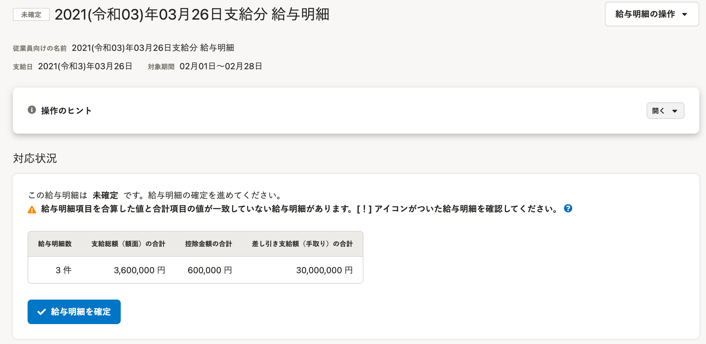
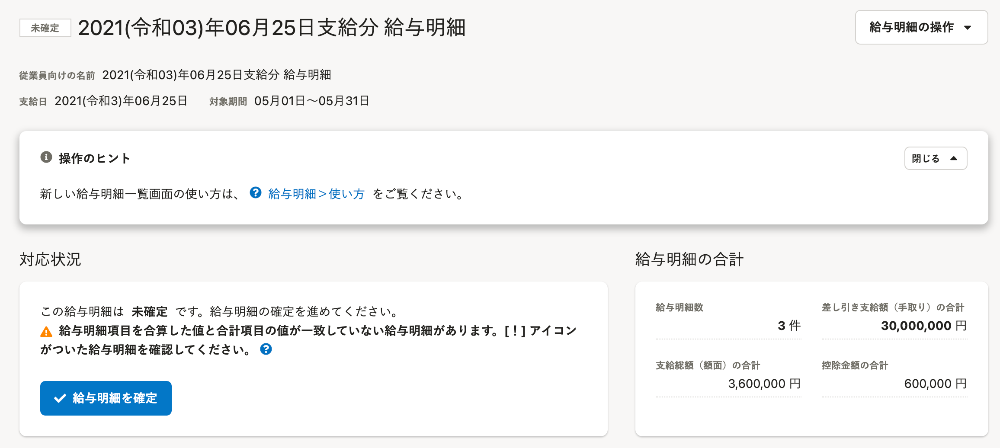

2021年9月2日（木）に行なったアップデートの詳細をお知らせします。

SmartHR基本機能の変更点は、カイゼン1件・不具合修正1件でした。

# 📈 カイゼン

## 給与明細画面に［給与明細の合計］パネルを表示するようにしました

これまでは給与明細画面の **［対応状況］** パネル内に、給与明細の合計の表を一緒に表示していました。

しかし、この構造では表が表しているものが分かりづらく、エラーメッセージがある場合は、表に対するエラーに見えてしまうことがありました。

そのため今回の改修で、給与明細のステータスが **［未確定］［確定］［予約済み］［公開済み］** の場合は、 **［対応状況］** の右に、 **［給与明細の合計］** パネルを表示し、情報を分けることで視認性を高めました。

給与明細のステータスが **［失敗］［取り込み中］** の場合は、 **［対応状況］** のみ表示されます。

あわせて、下記の対応も行ないました。

- ページ上部にある **［給与明細一覧に戻る］** と、下のテキストの位置を調整
-  **［予約済み］［公開済み］** の状態で **［確定解除］** した際に表示されるダイアログ内の文言を変更

| 変更前 | 変更後 |
| --- | --- |
|  |  |

# 👨‍⚕️ 不具合修正

従業員招待フォームを入力する際の挙動に関する1件の不具合修正を行ないました。
