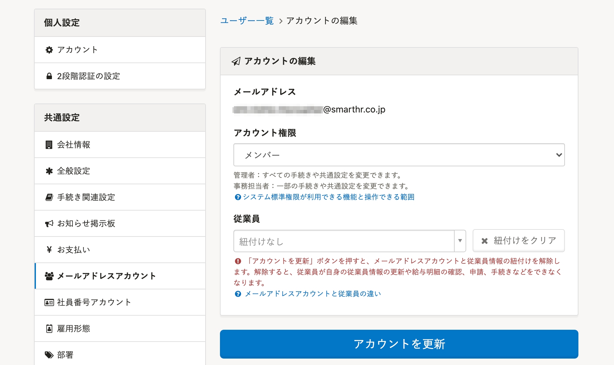
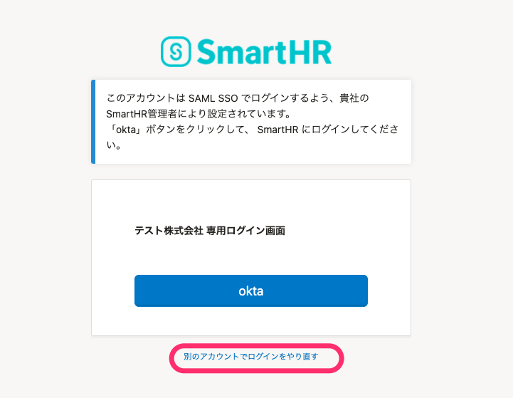

2021年9月6日（月）に行なったアップデートの詳細をお知らせします。

SmartHR基本機能の変更点は、カイゼン2件・不具合修正1件でした。

# 📈 カイゼン

## メールアドレスアカウントと従業員情報の紐付けを解除できるようにしました

メールアドレスや氏名が似ている場合に、メールアドレスアカウントと従業員情報を誤って紐付けてしまうケースがありました。

そのため、メールアドレスアカウントと従業員情報の紐付けを解除できるようにしました。

メールアドレスアカウントの **［アカウントの編集］** 画面から、 **［× 紐付けをクリア］>［アカウントを更新］** をクリックすると、紐付けを解除できます。

## SAML SSOが有効なアカウントでID/PWによるログインを試みた場合に表示される文言を変更しました

SAML SSOが有効なアカウントでID/PWを用いてログインを試みた場合に表示される文言を、下記のとおり変更しました。

- ［異なるアカウントでログインをやり直す］→［別のアカウントでログインをやり直す］

:::related
[SAML認証（SSO）を使ってログインする](https://knowledge.smarthr.jp/hc/ja/articles/360037085933)
:::

# 👨‍⚕️ 不具合修正

従業員情報の口座情報を更新した場合の挙動に関する1件の不具合修正を行ないました。
