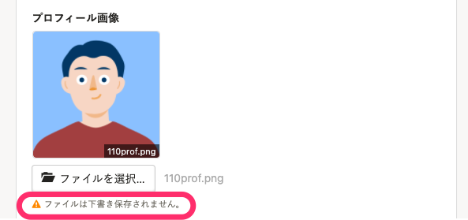
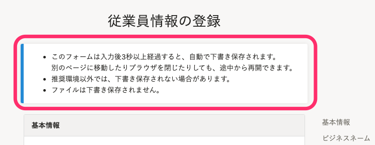

2021年9月9日（木）に行なったアップデートの詳細をお知らせします。

SmartHR基本機能の変更点は、カイゼン1件でした。

# 📈 カイゼン

## 招待フォームの入力画面で、アップロードしたファイルは下書き保存されないことを明示するようにしました

招待フォームの入力内容は自動で下書き保存されるようになっていますが、画像データなどのファイルは下書き保存されません。

今回のリリースで、ファイルが下書き保存されないことが明確に伝わるメッセージを表示するようにしました。

また、入力画面の上部のメッセージも目につきやすいように表示を変更しました。

****

その他、 **［下書きを保存する］** ボタンを押した際のメッセージの文言もあわせてカイゼンしました。
