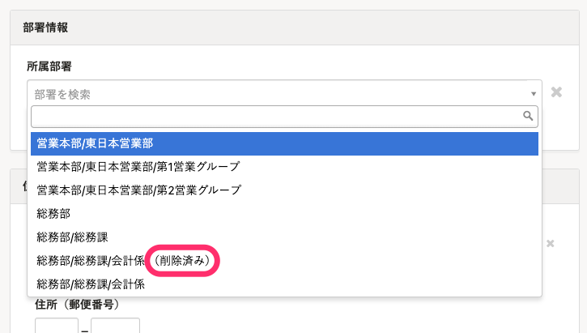

2021年9月13日（月）に行なったアップデートの詳細をお知らせします。

SmartHR基本機能の変更点は、カイゼン1件でした。

# 📈 カイゼン

## 従業員情報の履歴の追加・編集をする際、削除済みの部署に（削除済み）と表示するようにしました

従業員情報の履歴を追加・編集をする際に、部署項目の中で現在時点で削除されている部署には、部署名の後ろに **（削除済み）** と表示するようにしました。

過去に同じ名前の部署が存在した場合も、現在使われている部署と区別できるようになりました。

:::related
[適用日を指定して従業員情報を登録する](https://knowledge.smarthr.jp/hc/ja/articles/360026262253)
:::

