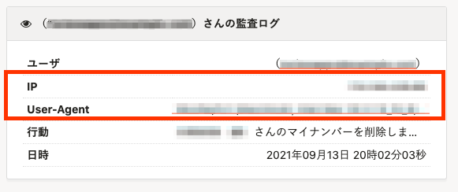

2021年9月14日（火）に行なったアップデートの詳細をお知らせします。

SmartHR基本機能の変更点は、カイゼン2件・不具合修正1件でした。

# 📈 カイゼン

## トライアル終了画面の料金プランの表に予約管理機能を追加しました

トライアル終了画面に表示される料金プランの表に、先日リリースした予約管理機能を追加し、情報を最新にしました。

## マイナンバーを一括削除した際に監査ログに［IP］と［User-Agent］を表示するようにしました

マイナンバーを個別削除した際の監査ログにあわせて、一括削除した際も監査ログに **［IP］** と **［User-Agent］** を表示するようにしました。

# 👨‍⚕️ 不具合修正

部署を追加する際に特定の操作をした際の挙動に関する1件の不具合修正を行ないました。
