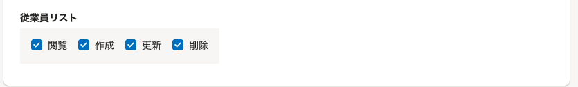
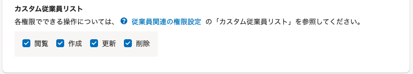

2021年9月15日（水）に行なったアップデートの詳細をお知らせします。

SmartHR基本機能の変更点は、カイゼン1件・不具合修正2件でした。

# 📈 カイゼン

## 権限設定の［従業員関連］にある［従業員リスト］の文言を［カスタム従業員リスト］に変更しました

この項目は、従業員リストのカスタムリストについての権限設定ですが、 **［従業員リスト］** と表記されていたため、従業員リスト機能全体の権限設定のように見え、誤解を与えることがありました。

そのため今回のリリースで、 **［従業員リスト］** の文言を **［カスタム従業員リスト］** に変更しました。

あわせて、従業員関連の権限設定のヘルプページ（[従業員関連の閲覧・作成・更新・削除の権限を設定する](https://knowledge.smarthr.jp/hc/ja/articles/1500001368101)）へのリンクを設定しました。

| 変更前 | 変更後 |
| --- | --- |
|  |  |

# 👨‍⚕️ 不具合修正

特定の権限でチャットサポートを使用した際の挙動に関する修正など、2件の不具合修正を行ないました。
