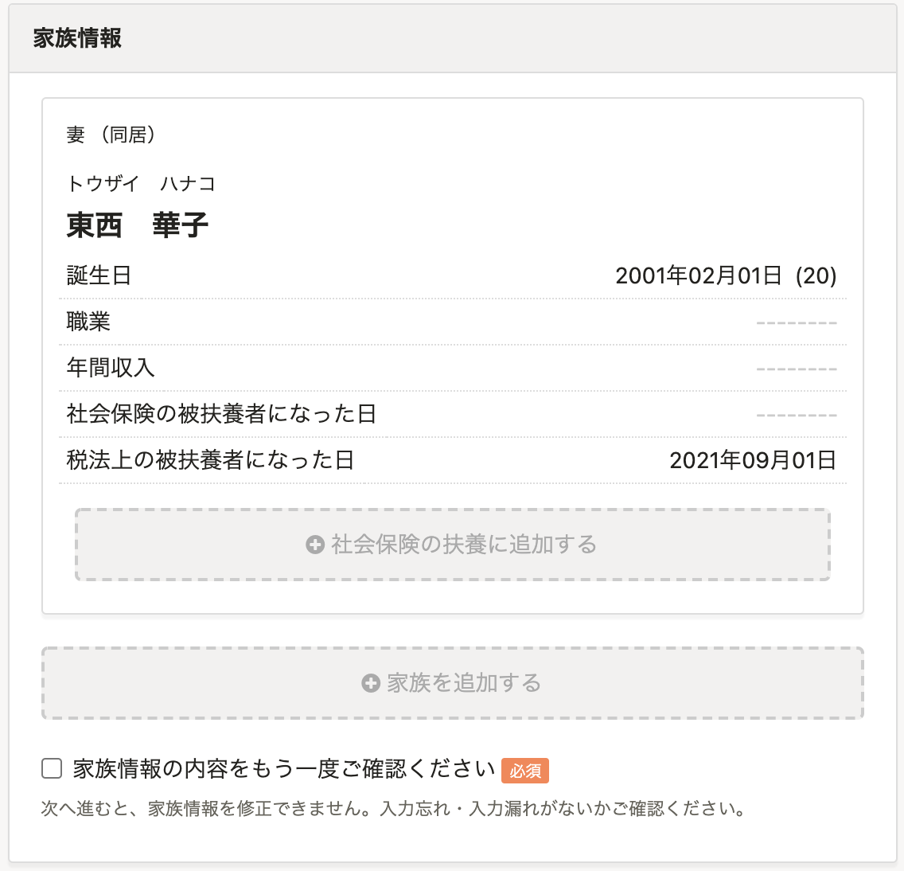
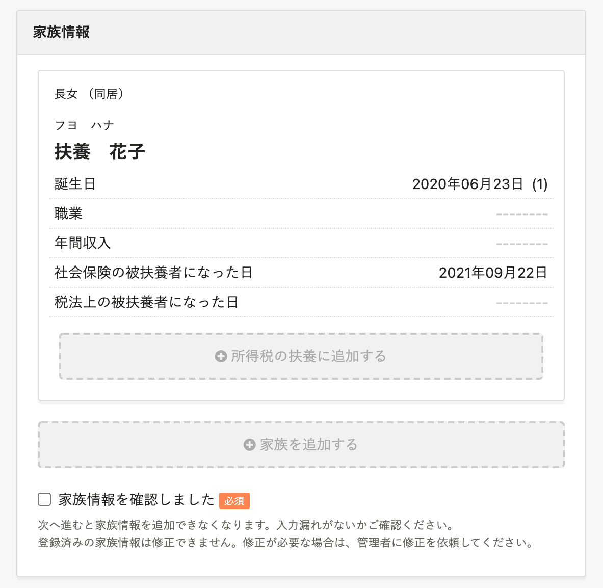
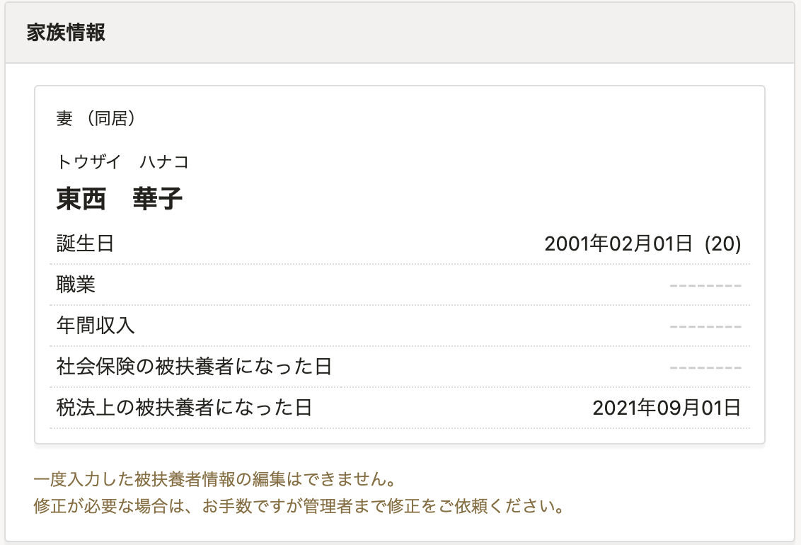
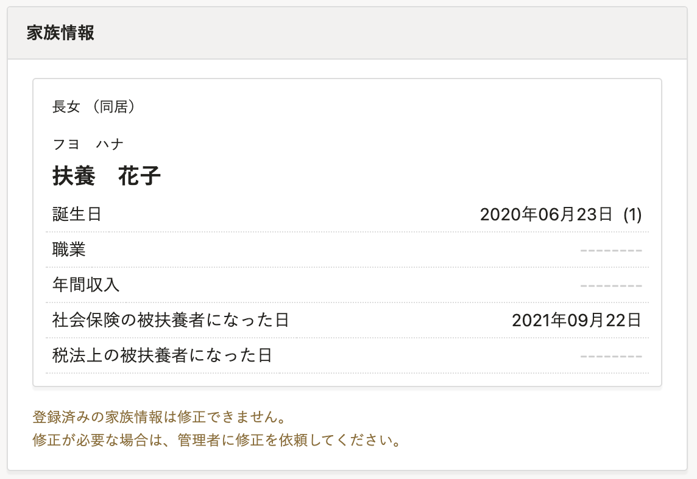
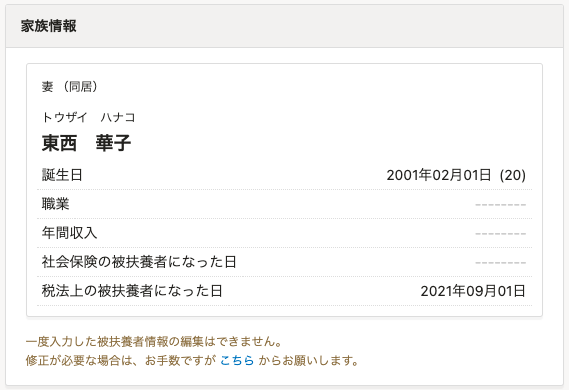
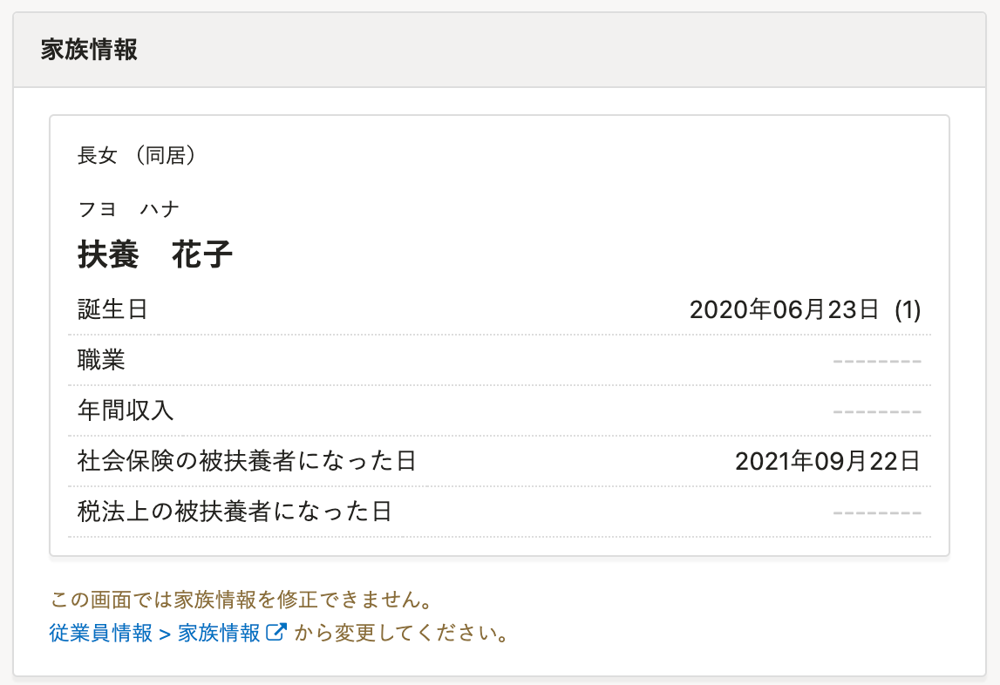

2021年9月21日（火）に行なったアップデートの詳細をお知らせします。

SmartHR基本機能の変更点は、カイゼン1件でした。

# 📈 カイゼン

## 入社手続きで従業員が基本情報を入力する際の、家族情報の確認文言を変更しました

 **［入社の手続き］>［本人に基本情報を入力してもらう］** のフローで、家族情報を入力した際の確認画面の文言を変更しました。

一度入力した家族情報は修正できない仕様ですが、これまでの文言だと修正できるような誤解を与えることがあったため、文言を変更しました。

また、管理者確認画面の文言もあわせて修正しました。

関連箇所は下記のとおりです。

- 従業員情報作成画面

| 変更前 | 変更後 |
| --- | --- |
|  |  |

- 修正画面

| 変更前 | 変更後 |
| --- | --- |
|  |  |

- 管理者確認画面

| 変更前 | 変更後 |
| --- | --- |
|  |  |
